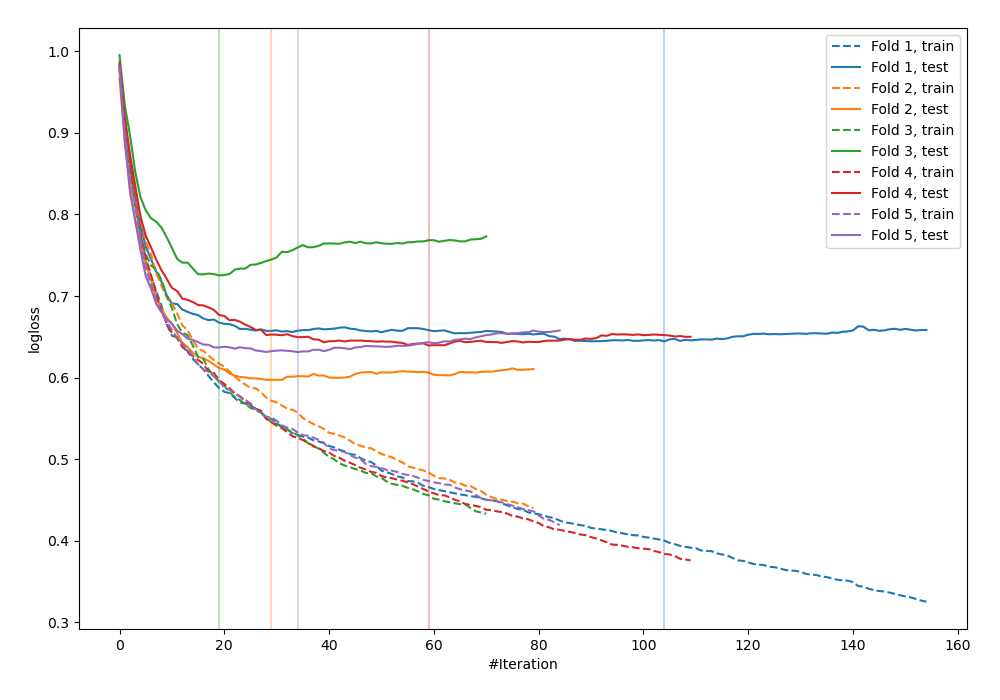
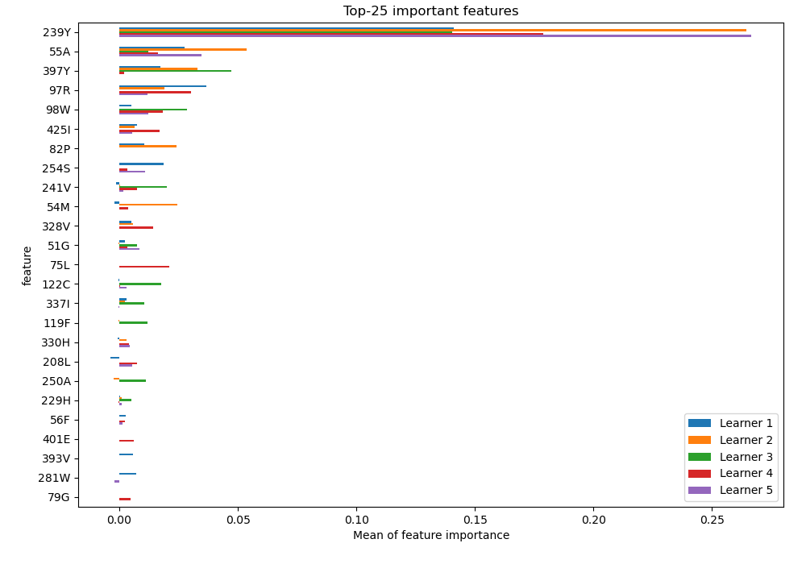
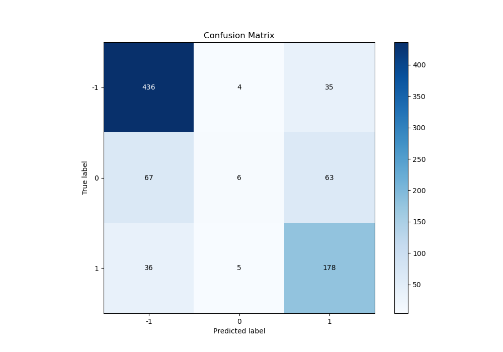
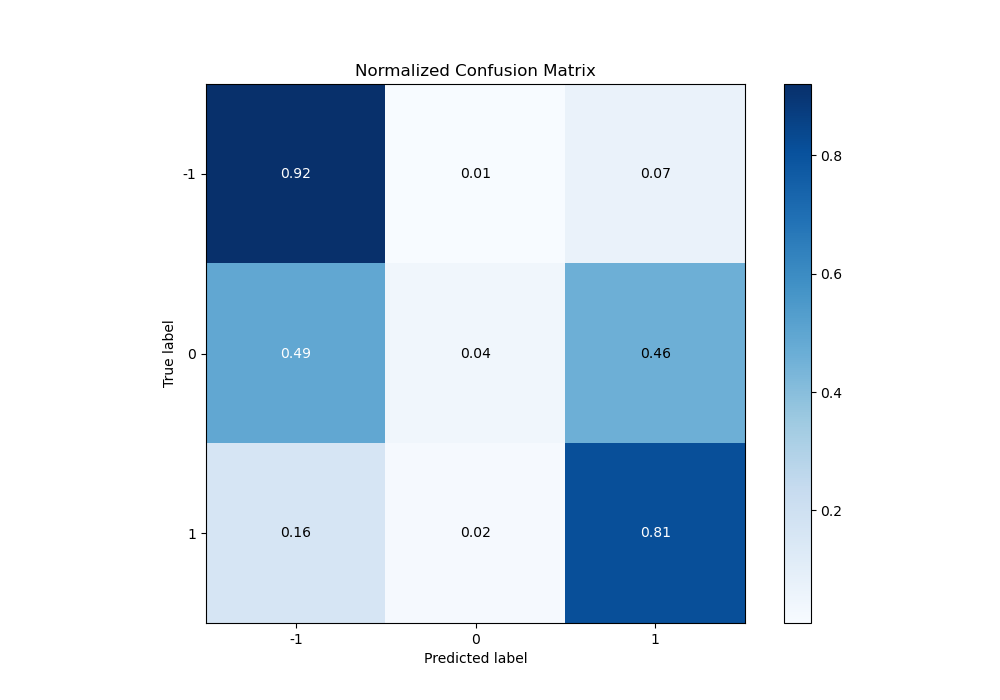
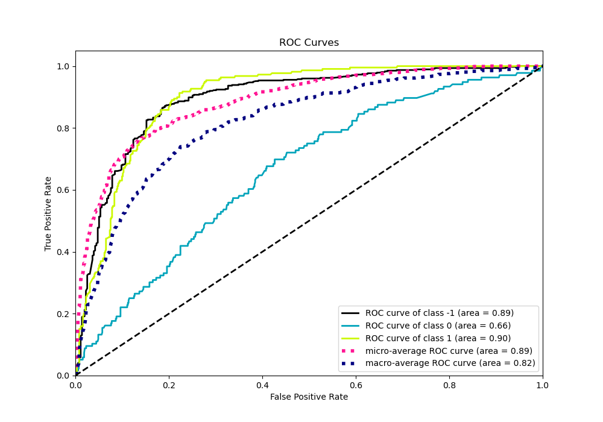
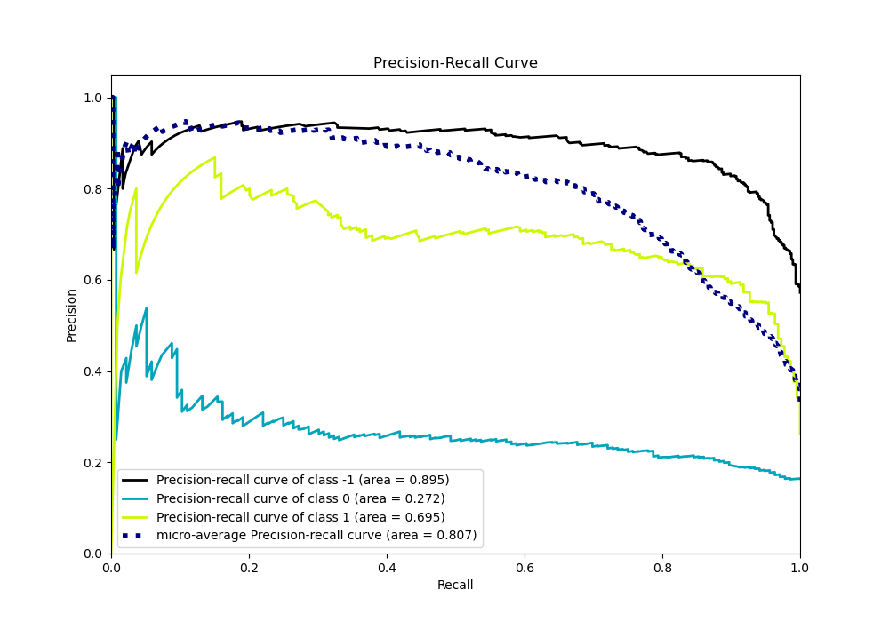

# Summary of 10_CatBoost

[<< Go back](../README.md)

## CatBoost
- **n_jobs**: -1
- **learning_rate**: 0.2
- **depth**: 6
- **rsm**: 0.9
- **loss_function**: MultiClass
- **eval_metric**: MultiClass
- **num_class**: 3
- **explain_level**: 2

## Validation
 - **validation_type**: kfold
 - **k_folds**: 5
 - **shuffle**: True
 - **stratify**: True

## Optimized metric
logloss

## Training time

184.6 seconds

### Metric details
|           |         -1 |           0 |          1 |   accuracy |   macro avg |   weighted avg |   logloss |
|:----------|-----------:|------------:|-----------:|-----------:|------------:|---------------:|----------:|
| precision |   0.808905 |   0.4       |   0.644928 |   0.746988 |    0.617944 |       0.698638 |  0.647652 |
| recall    |   0.917895 |   0.0441176 |   0.812785 |   0.746988 |    0.591599 |       0.746988 |  0.647652 |
| f1-score  |   0.859961 |   0.0794702 |   0.719192 |   0.746988 |    0.552874 |       0.69493  |  0.647652 |
| support   | 475        | 136         | 219        |   0.746988 |  830        |     830        |  0.647652 |

## Confusion matrix
|               |   Predicted as -1 |   Predicted as 0 |   Predicted as 1 |
|:--------------|------------------:|-----------------:|-----------------:|
| Labeled as -1 |               436 |                4 |               35 |
| Labeled as 0  |                67 |                6 |               63 |
| Labeled as 1  |                36 |                5 |              178 |

## Learning curves

## Permutation-based Importance

## Confusion Matrix

## Normalized Confusion Matrix

## ROC Curve

## Precision Recall Curve

[<< Go back](../README.md)
