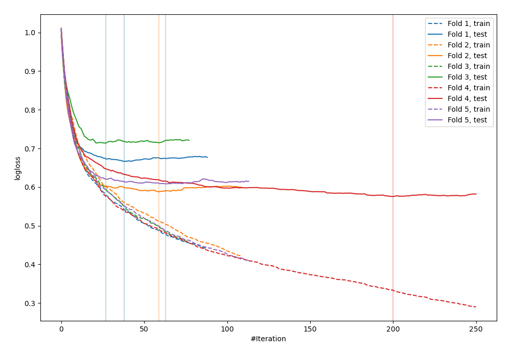
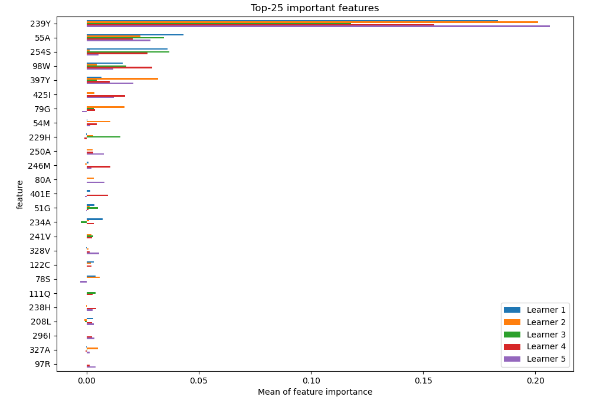
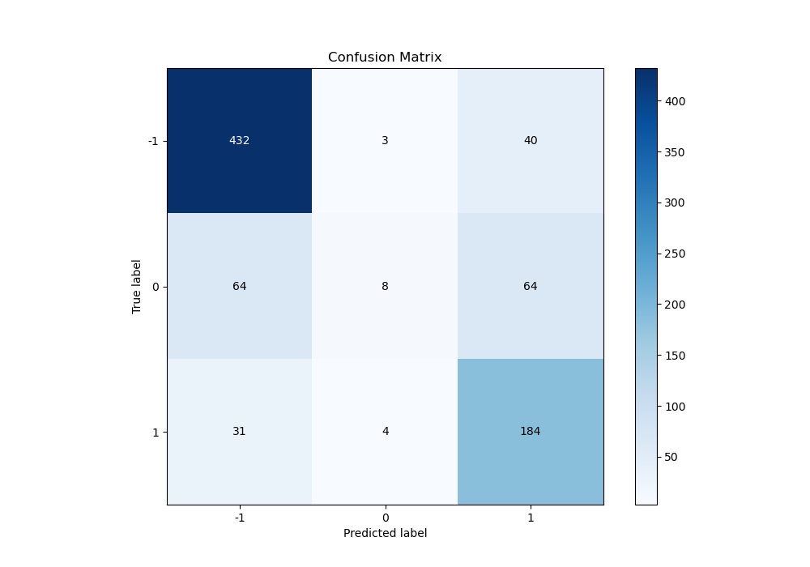
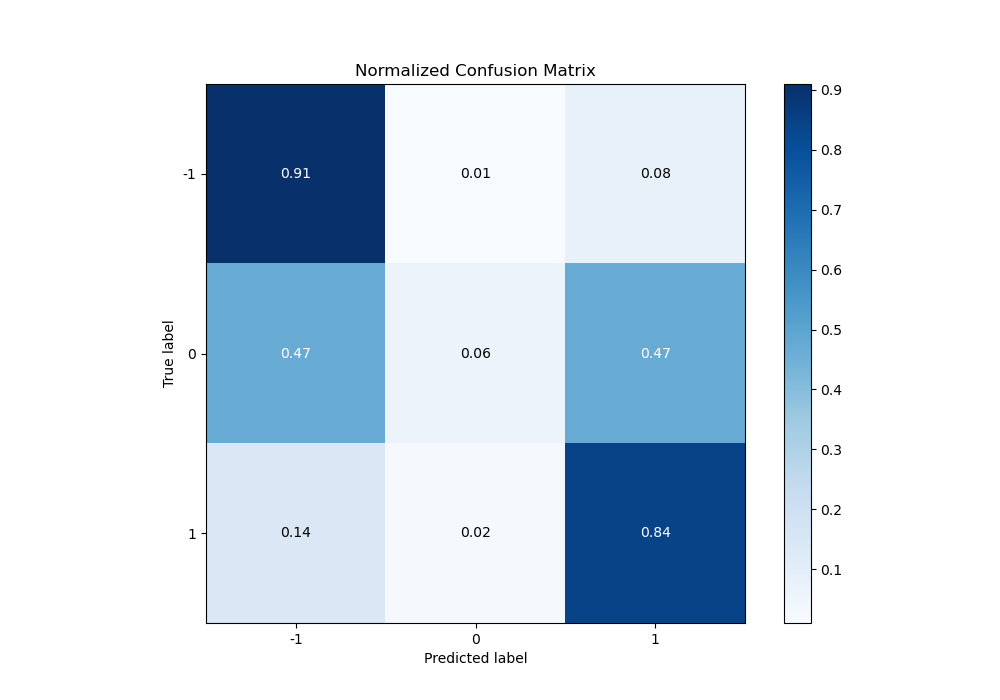
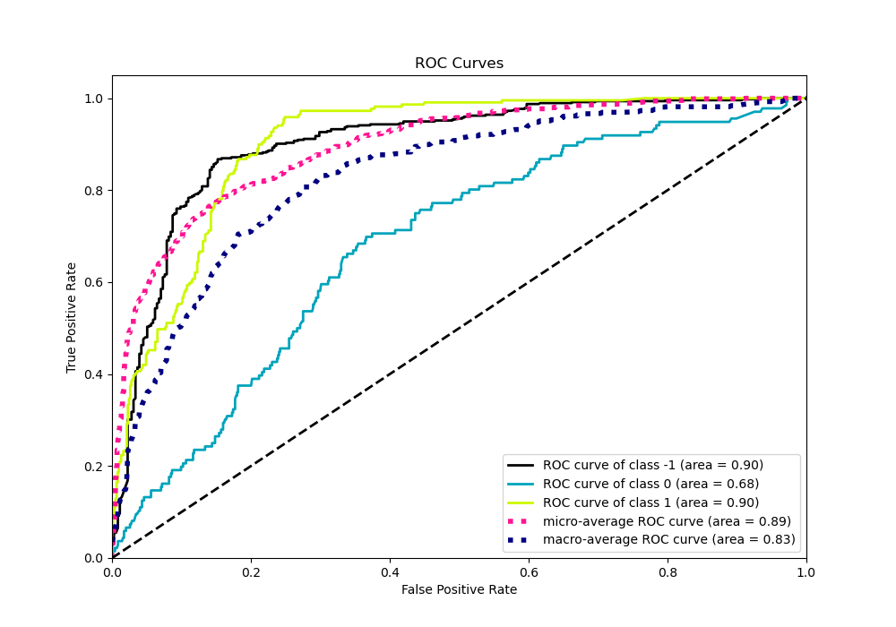
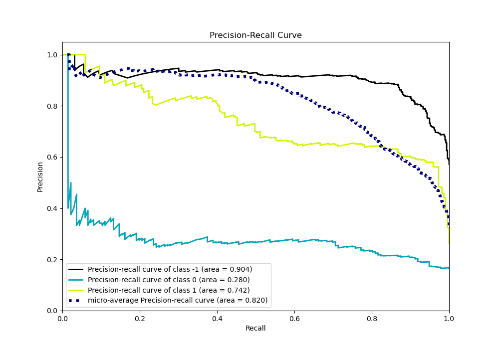

# Summary of 11_CatBoost

[<< Go back](../README.md)

## CatBoost
- **n_jobs**: -1
- **learning_rate**: 0.15
- **depth**: 6
- **rsm**: 0.8
- **loss_function**: MultiClass
- **eval_metric**: MultiClass
- **num_class**: 3
- **explain_level**: 2

## Validation
 - **validation_type**: kfold
 - **k_folds**: 5
 - **shuffle**: True
 - **stratify**: True

## Optimized metric
logloss

## Training time

202.9 seconds

### Metric details
|           |         -1 |           0 |          1 |   accuracy |   macro avg |   weighted avg |   logloss |
|:----------|-----------:|------------:|-----------:|-----------:|------------:|---------------:|----------:|
| precision |   0.819734 |   0.533333  |   0.638889 |   0.751807 |    0.663986 |       0.725089 |  0.630375 |
| recall    |   0.909474 |   0.0588235 |   0.840183 |   0.751807 |    0.602827 |       0.751807 |  0.630375 |
| f1-score  |   0.862275 |   0.10596   |   0.725838 |   0.751807 |    0.564691 |       0.702349 |  0.630375 |
| support   | 475        | 136         | 219        |   0.751807 |  830        |     830        |  0.630375 |

## Confusion matrix
|               |   Predicted as -1 |   Predicted as 0 |   Predicted as 1 |
|:--------------|------------------:|-----------------:|-----------------:|
| Labeled as -1 |               432 |                3 |               40 |
| Labeled as 0  |                64 |                8 |               64 |
| Labeled as 1  |                31 |                4 |              184 |

## Learning curves

## Permutation-based Importance

## Confusion Matrix

## Normalized Confusion Matrix

## ROC Curve

## Precision Recall Curve

[<< Go back](../README.md)
