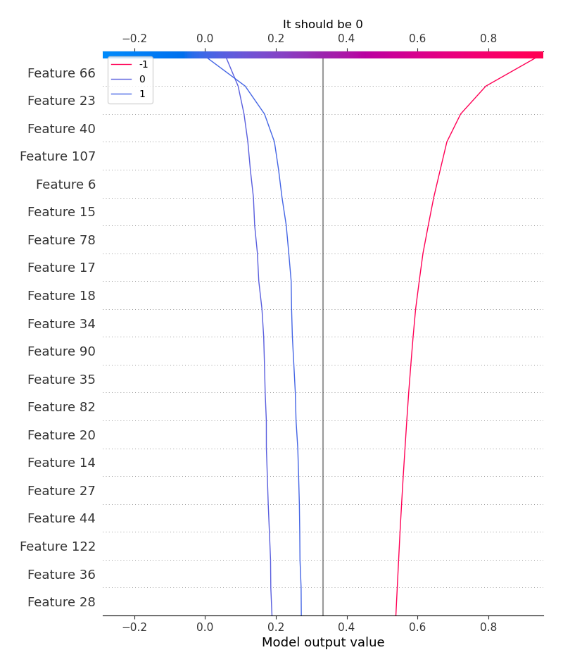

# Summary of 15_RandomForest

[<< Go back](../README.md)

## Random Forest
- **n_jobs**: -1
- **criterion**: entropy
- **max_features**: 0.6
- **min_samples_split**: 50
- **max_depth**: 6
- **eval_metric_name**: logloss
- **num_class**: 3
- **explain_level**: 2

## Validation
 - **validation_type**: kfold
 - **k_folds**: 5
 - **shuffle**: True
 - **stratify**: True

## Optimized metric
logloss

## Training time

75.9 seconds

### Metric details
|           |         -1 |           0 |          1 |   accuracy |   macro avg |   weighted avg |   logloss |
|:----------|-----------:|------------:|-----------:|-----------:|------------:|---------------:|----------:|
| precision |   0.816981 |   0.416667  |   0.645833 |   0.751807 |    0.626494 |       0.706229 |  0.648259 |
| recall    |   0.911579 |   0.0367647 |   0.849315 |   0.751807 |    0.59922  |       0.751807 |  0.648259 |
| f1-score  |   0.861692 |   0.0675676 |   0.733728 |   0.751807 |    0.554329 |       0.697806 |  0.648259 |
| support   | 475        | 136         | 219        |   0.751807 |  830        |     830        |  0.648259 |

## Confusion matrix
|               |   Predicted as -1 |   Predicted as 0 |   Predicted as 1 |
|:--------------|------------------:|-----------------:|-----------------:|
| Labeled as -1 |               433 |                3 |               39 |
| Labeled as 0  |                68 |                5 |               63 |
| Labeled as 1  |                29 |                4 |              186 |

## Learning curves

## Permutation-based Importance

## Confusion Matrix

## Normalized Confusion Matrix

## ROC Curve

## Precision Recall Curve

## SHAP Importance

## SHAP Dependence plots

### Dependence -1 (Fold 1)

### Dependence 0 (Fold 1)

### Dependence 1 (Fold 1)

### Dependence -1 (Fold 2)

### Dependence 0 (Fold 2)

### Dependence 1 (Fold 2)

### Dependence -1 (Fold 3)

### Dependence 0 (Fold 3)

### Dependence 1 (Fold 3)

### Dependence -1 (Fold 4)

### Dependence 0 (Fold 4)

### Dependence 1 (Fold 4)

### Dependence -1 (Fold 5)

### Dependence 0 (Fold 5)

### Dependence 1 (Fold 5)

## SHAP Decision plots

### Worst decisions for selected sample 1 (Fold 1)

### Worst decisions for selected sample 1 (Fold 2)

### Worst decisions for selected sample 1 (Fold 3)

### Worst decisions for selected sample 1 (Fold 4)

### Worst decisions for selected sample 1 (Fold 5)

### Worst decisions for selected sample 2 (Fold 1)

### Worst decisions for selected sample 2 (Fold 2)

### Worst decisions for selected sample 2 (Fold 3)

### Worst decisions for selected sample 2 (Fold 4)

### Worst decisions for selected sample 2 (Fold 5)

### Worst decisions for selected sample 3 (Fold 1)

### Worst decisions for selected sample 3 (Fold 2)

### Worst decisions for selected sample 3 (Fold 3)

### Worst decisions for selected sample 3 (Fold 4)

### Worst decisions for selected sample 3 (Fold 5)

### Worst decisions for selected sample 4 (Fold 1)

### Worst decisions for selected sample 4 (Fold 2)

### Worst decisions for selected sample 4 (Fold 3)

### Worst decisions for selected sample 4 (Fold 4)

### Worst decisions for selected sample 4 (Fold 5)

### Best decisions for selected sample 1 (Fold 1)

### Best decisions for selected sample 1 (Fold 2)

### Best decisions for selected sample 1 (Fold 3)

### Best decisions for selected sample 1 (Fold 4)

### Best decisions for selected sample 1 (Fold 5)

### Best decisions for selected sample 2 (Fold 1)

### Best decisions for selected sample 2 (Fold 2)

### Best decisions for selected sample 2 (Fold 3)

### Best decisions for selected sample 2 (Fold 4)

### Best decisions for selected sample 2 (Fold 5)

### Best decisions for selected sample 3 (Fold 1)

### Best decisions for selected sample 3 (Fold 2)

### Best decisions for selected sample 3 (Fold 3)

### Best decisions for selected sample 3 (Fold 4)

### Best decisions for selected sample 3 (Fold 5)

### Best decisions for selected sample 4 (Fold 1)

### Best decisions for selected sample 4 (Fold 2)

### Best decisions for selected sample 4 (Fold 3)

### Best decisions for selected sample 4 (Fold 4)

### Best decisions for selected sample 4 (Fold 5)

[<< Go back](../README.md)
