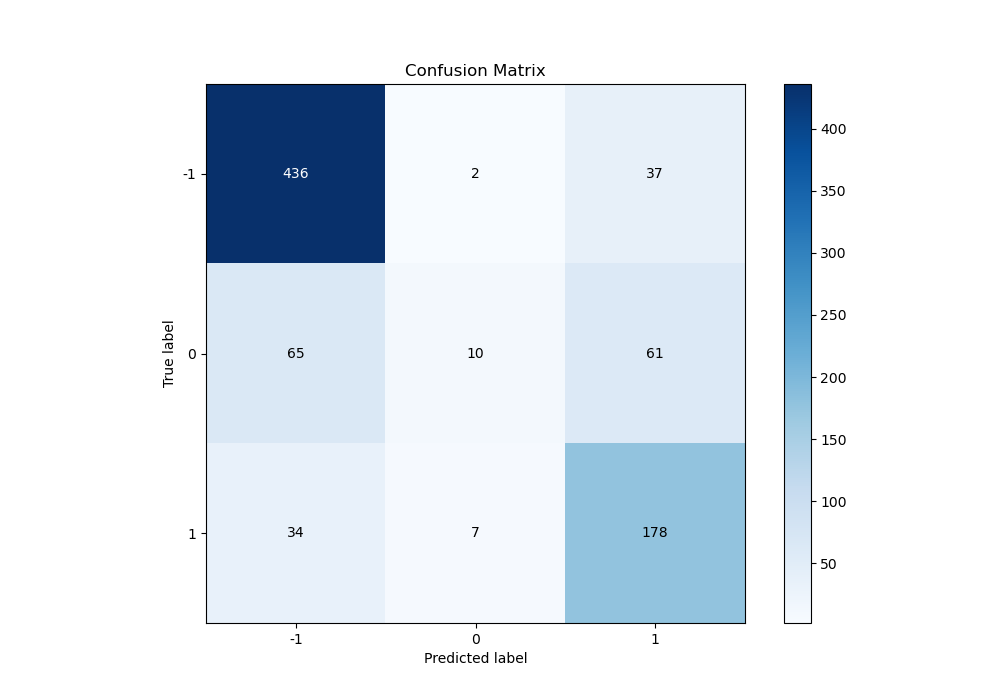

# Summary of 16_CatBoost

[<< Go back](../README.md)

## CatBoost
- **n_jobs**: -1
- **learning_rate**: 0.1
- **depth**: 6
- **rsm**: 0.8
- **loss_function**: MultiClass
- **eval_metric**: MultiClass
- **num_class**: 3
- **explain_level**: 2

## Validation
 - **validation_type**: kfold
 - **k_folds**: 5
 - **shuffle**: True
 - **stratify**: True

## Optimized metric
logloss

## Training time

281.5 seconds

### Metric details
|           |         -1 |           0 |          1 |   accuracy |   macro avg |   weighted avg |   logloss |
|:----------|-----------:|------------:|-----------:|-----------:|------------:|---------------:|----------:|
| precision |   0.814953 |   0.526316  |   0.644928 |   0.751807 |    0.662066 |       0.722796 |  0.637018 |
| recall    |   0.917895 |   0.0735294 |   0.812785 |   0.751807 |    0.601403 |       0.751807 |  0.637018 |
| f1-score  |   0.863366 |   0.129032  |   0.719192 |   0.751807 |    0.57053  |       0.705001 |  0.637018 |
| support   | 475        | 136         | 219        |   0.751807 |  830        |     830        |  0.637018 |

## Confusion matrix
|               |   Predicted as -1 |   Predicted as 0 |   Predicted as 1 |
|:--------------|------------------:|-----------------:|-----------------:|
| Labeled as -1 |               436 |                2 |               37 |
| Labeled as 0  |                65 |               10 |               61 |
| Labeled as 1  |                34 |                7 |              178 |

## Learning curves

## Permutation-based Importance

## Confusion Matrix

## Normalized Confusion Matrix

## ROC Curve

## Precision Recall Curve

[<< Go back](../README.md)
