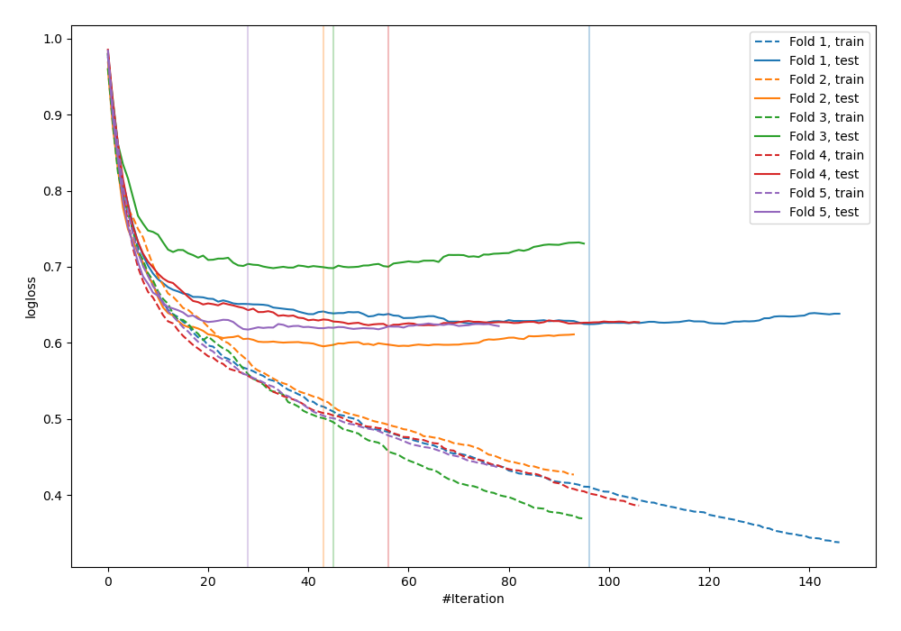
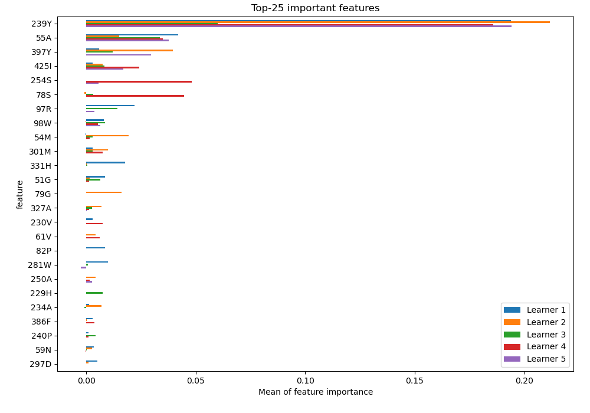
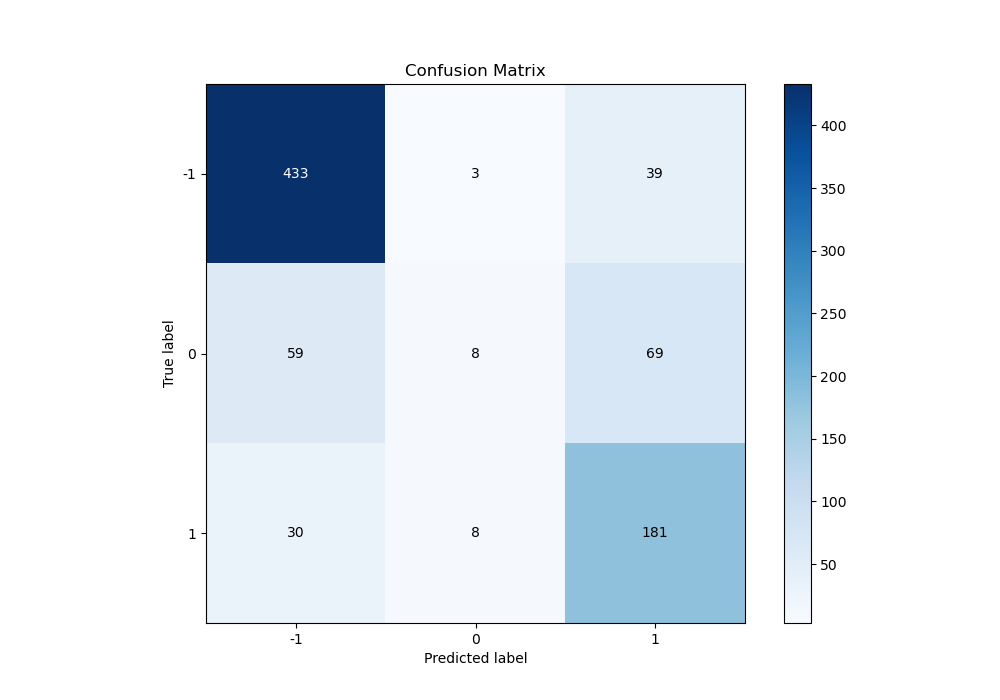
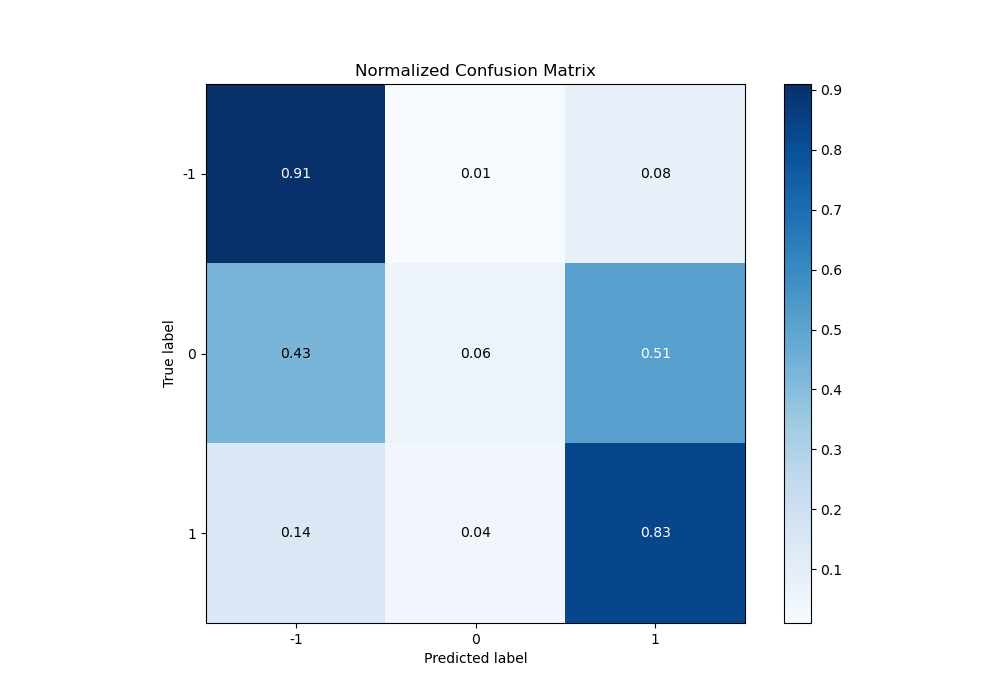
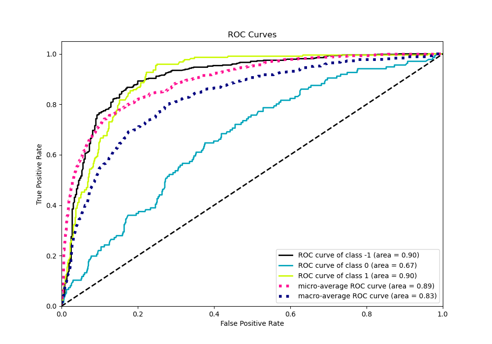
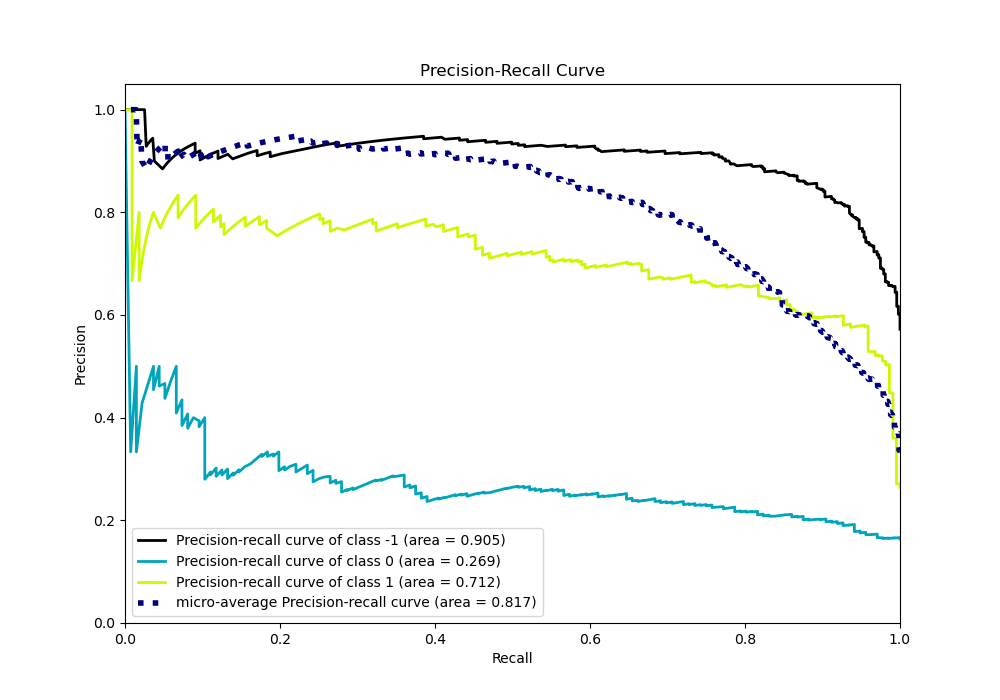

# Summary of 17_CatBoost

[<< Go back](../README.md)

## CatBoost
- **n_jobs**: -1
- **learning_rate**: 0.2
- **depth**: 6
- **rsm**: 0.8
- **loss_function**: MultiClass
- **eval_metric**: MultiClass
- **num_class**: 3
- **explain_level**: 2

## Validation
 - **validation_type**: kfold
 - **k_folds**: 5
 - **shuffle**: True
 - **stratify**: True

## Optimized metric
logloss

## Training time

190.4 seconds

### Metric details
|           |         -1 |           0 |          1 |   accuracy |   macro avg |   weighted avg |   logloss |
|:----------|-----------:|------------:|-----------:|-----------:|------------:|---------------:|----------:|
| precision |   0.829502 |   0.421053  |   0.626298 |   0.749398 |    0.625617 |       0.708959 |  0.631446 |
| recall    |   0.911579 |   0.0588235 |   0.826484 |   0.749398 |    0.598962 |       0.749398 |  0.631446 |
| f1-score  |   0.868606 |   0.103226  |   0.712598 |   0.749398 |    0.561477 |       0.702031 |  0.631446 |
| support   | 475        | 136         | 219        |   0.749398 |  830        |     830        |  0.631446 |

## Confusion matrix
|               |   Predicted as -1 |   Predicted as 0 |   Predicted as 1 |
|:--------------|------------------:|-----------------:|-----------------:|
| Labeled as -1 |               433 |                3 |               39 |
| Labeled as 0  |                59 |                8 |               69 |
| Labeled as 1  |                30 |                8 |              181 |

## Learning curves

## Permutation-based Importance

## Confusion Matrix

## Normalized Confusion Matrix

## ROC Curve

## Precision Recall Curve

[<< Go back](../README.md)
