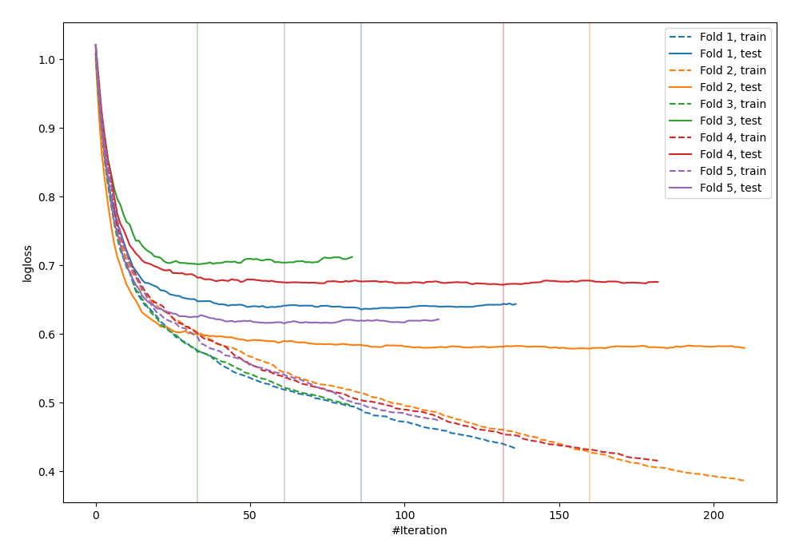
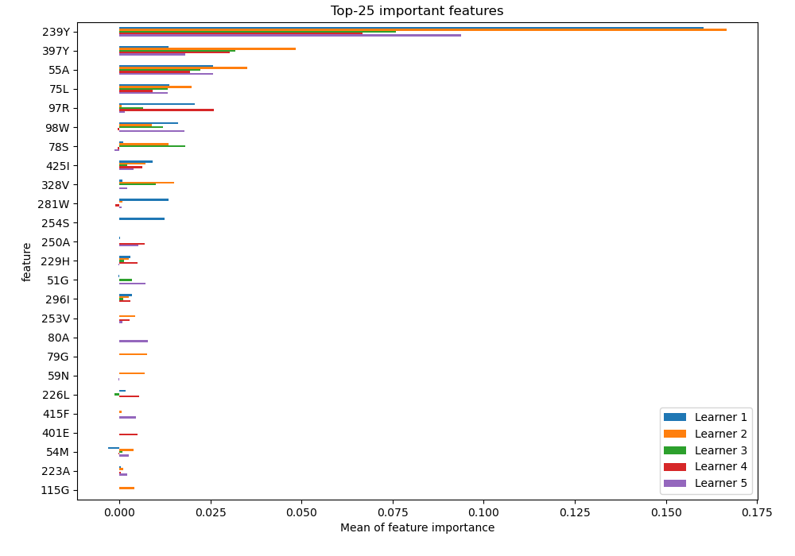
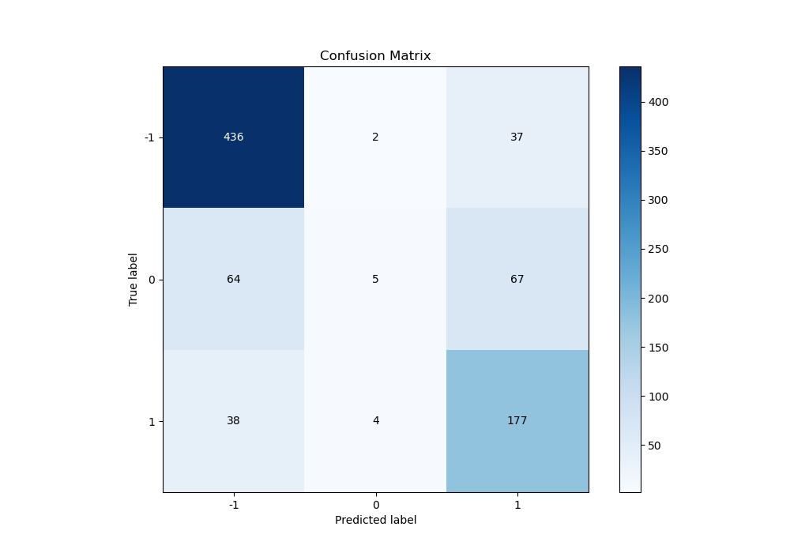
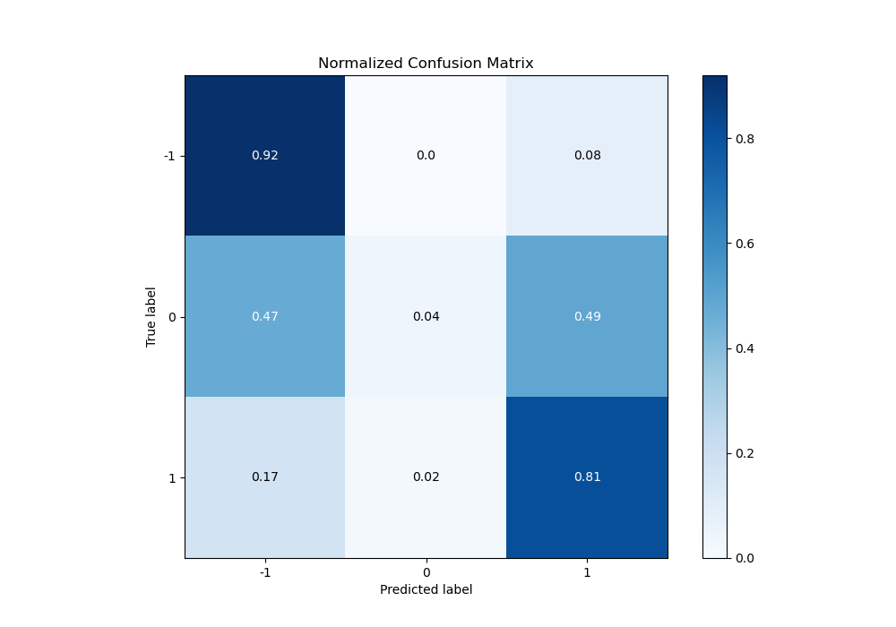
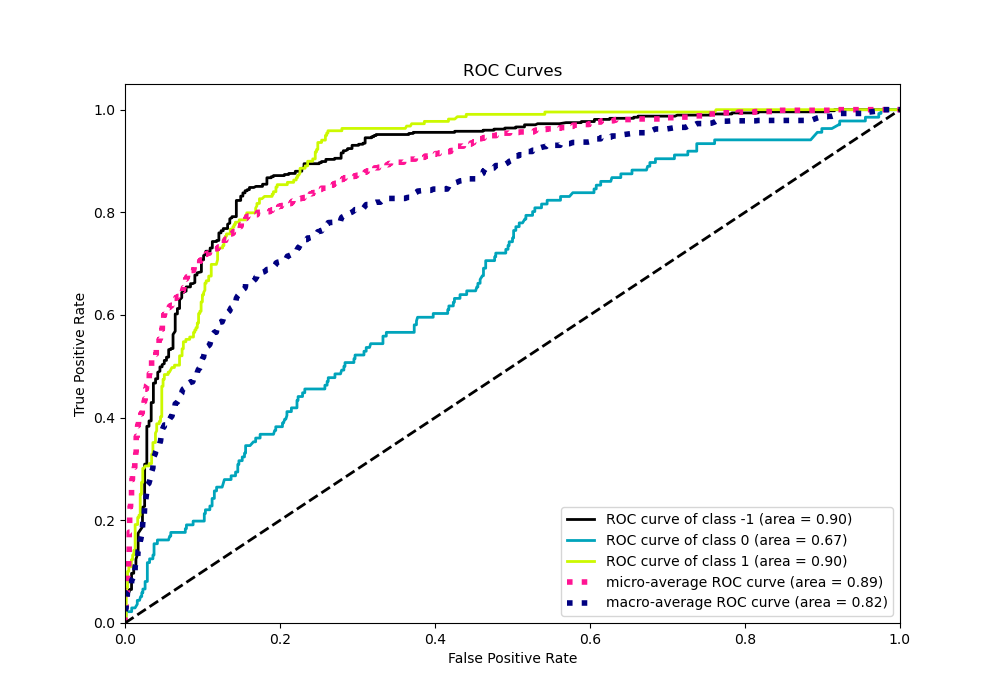
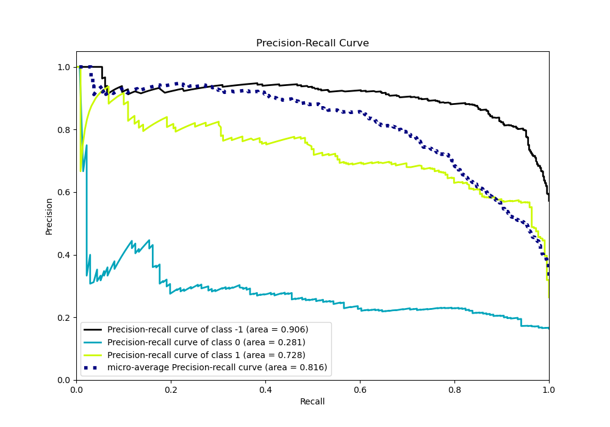

# Summary of 18_CatBoost

[<< Go back](../README.md)

## CatBoost
- **n_jobs**: -1
- **learning_rate**: 0.15
- **depth**: 5
- **rsm**: 0.7
- **loss_function**: MultiClass
- **eval_metric**: MultiClass
- **num_class**: 3
- **explain_level**: 2

## Validation
 - **validation_type**: kfold
 - **k_folds**: 5
 - **shuffle**: True
 - **stratify**: True

## Optimized metric
logloss

## Training time

176.6 seconds

### Metric details
|           |         -1 |           0 |          1 |   accuracy |   macro avg |   weighted avg |   logloss |
|:----------|-----------:|------------:|-----------:|-----------:|------------:|---------------:|----------:|
| precision |   0.810409 |   0.454545  |   0.629893 |   0.744578 |    0.631616 |       0.704469 |  0.640457 |
| recall    |   0.917895 |   0.0367647 |   0.808219 |   0.744578 |    0.587626 |       0.744578 |  0.640457 |
| f1-score  |   0.860809 |   0.0680272 |   0.708    |   0.744578 |    0.545612 |       0.690588 |  0.640457 |
| support   | 475        | 136         | 219        |   0.744578 |  830        |     830        |  0.640457 |

## Confusion matrix
|               |   Predicted as -1 |   Predicted as 0 |   Predicted as 1 |
|:--------------|------------------:|-----------------:|-----------------:|
| Labeled as -1 |               436 |                2 |               37 |
| Labeled as 0  |                64 |                5 |               67 |
| Labeled as 1  |                38 |                4 |              177 |

## Learning curves

## Permutation-based Importance

## Confusion Matrix

## Normalized Confusion Matrix

## ROC Curve

## Precision Recall Curve

[<< Go back](../README.md)
