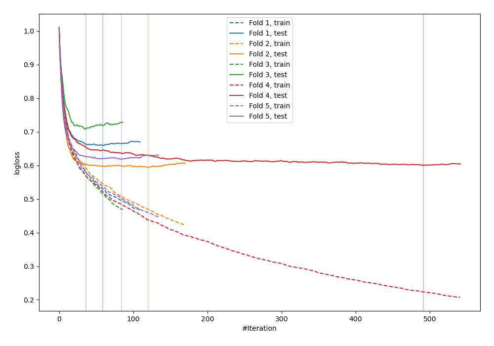
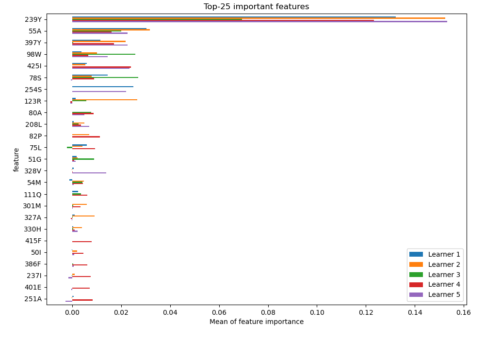
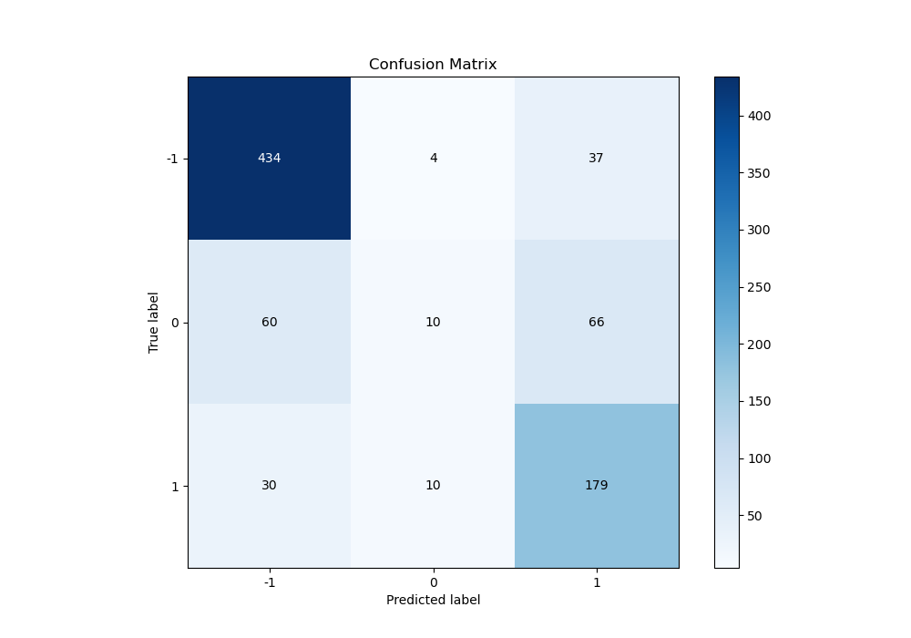
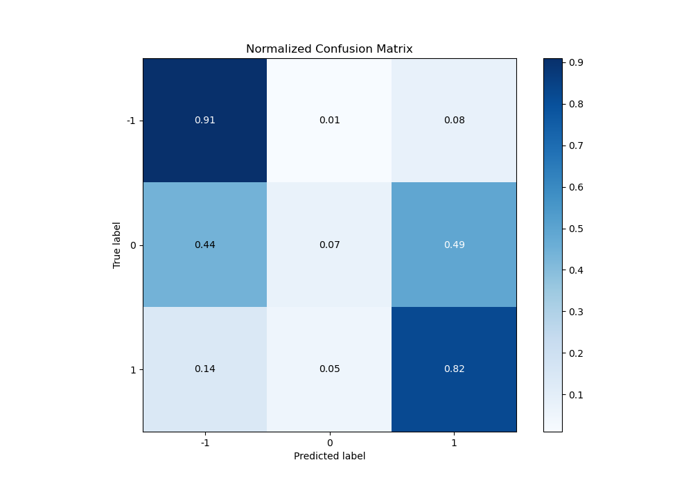
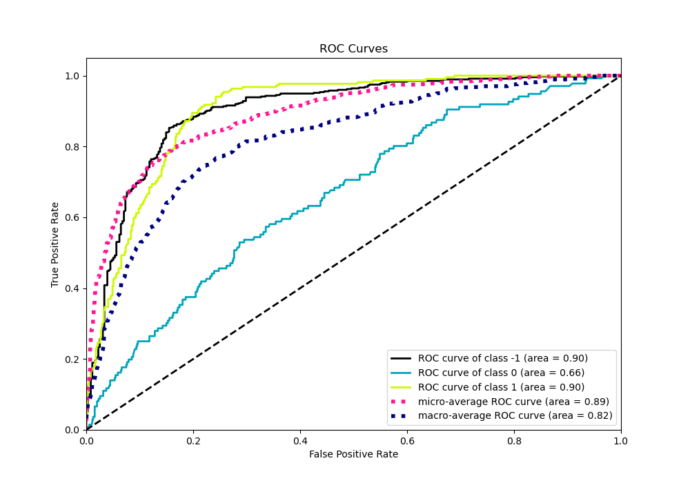
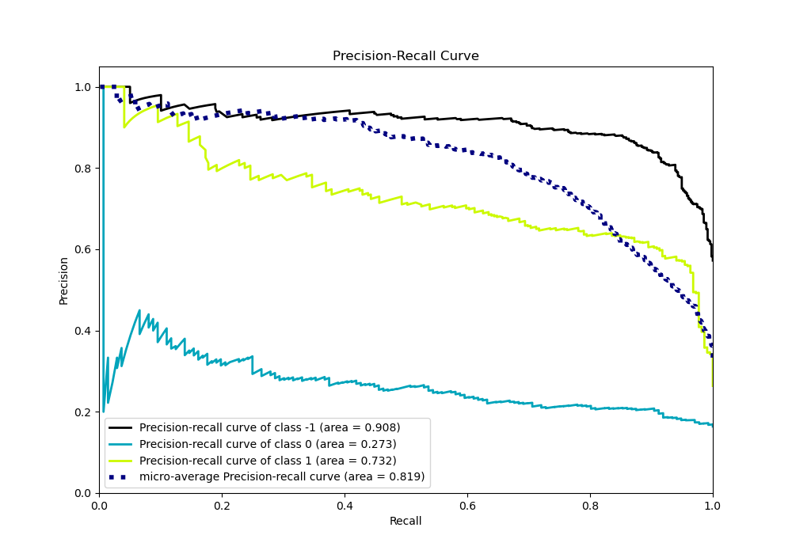

# Summary of 24_CatBoost

[<< Go back](../README.md)

## CatBoost
- **n_jobs**: -1
- **learning_rate**: 0.15
- **depth**: 5
- **rsm**: 0.8
- **loss_function**: MultiClass
- **eval_metric**: MultiClass
- **num_class**: 3
- **explain_level**: 2

## Validation
 - **validation_type**: kfold
 - **k_folds**: 5
 - **shuffle**: True
 - **stratify**: True

## Optimized metric
logloss

## Training time

207.6 seconds

### Metric details
|           |         -1 |           0 |          1 |   accuracy |   macro avg |   weighted avg |   logloss |
|:----------|-----------:|------------:|-----------:|-----------:|------------:|---------------:|----------:|
| precision |   0.828244 |   0.416667  |   0.634752 |   0.750602 |    0.626554 |       0.709751 |  0.636132 |
| recall    |   0.913684 |   0.0735294 |   0.817352 |   0.750602 |    0.601522 |       0.750602 |  0.636132 |
| f1-score  |   0.868869 |   0.125     |   0.714571 |   0.750602 |    0.56948  |       0.70627  |  0.636132 |
| support   | 475        | 136         | 219        |   0.750602 |  830        |     830        |  0.636132 |

## Confusion matrix
|               |   Predicted as -1 |   Predicted as 0 |   Predicted as 1 |
|:--------------|------------------:|-----------------:|-----------------:|
| Labeled as -1 |               434 |                4 |               37 |
| Labeled as 0  |                60 |               10 |               66 |
| Labeled as 1  |                30 |               10 |              179 |

## Learning curves

## Permutation-based Importance

## Confusion Matrix

## Normalized Confusion Matrix

## ROC Curve

## Precision Recall Curve

[<< Go back](../README.md)
