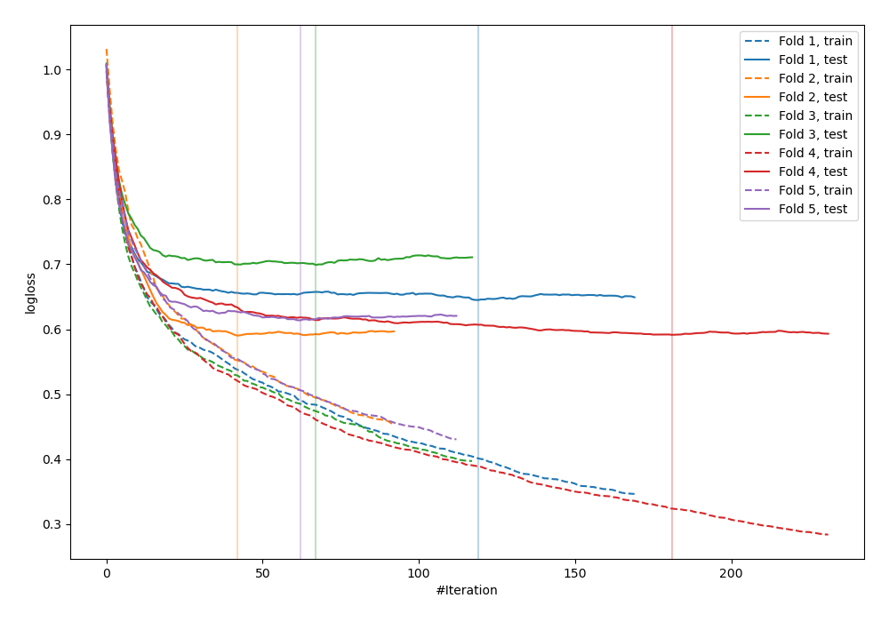
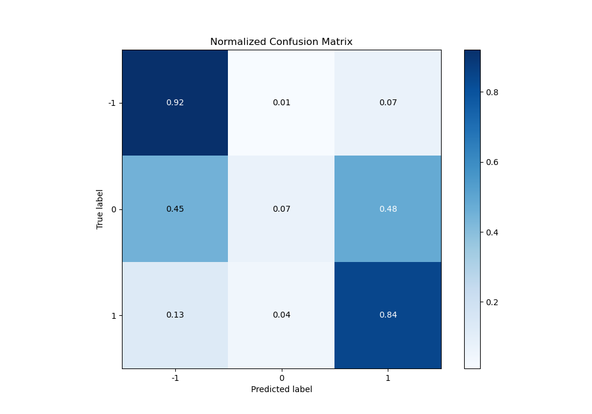

# Summary of 25_CatBoost

[<< Go back](../README.md)

## CatBoost
- **n_jobs**: -1
- **learning_rate**: 0.15
- **depth**: 6
- **rsm**: 0.7
- **loss_function**: MultiClass
- **eval_metric**: MultiClass
- **num_class**: 3
- **explain_level**: 2

## Validation
 - **validation_type**: kfold
 - **k_folds**: 5
 - **shuffle**: True
 - **stratify**: True

## Optimized metric
logloss

## Training time

162.6 seconds

### Metric details
|           |         -1 |           0 |          1 |   accuracy |   macro avg |   weighted avg |   logloss |
|:----------|-----------:|------------:|-----------:|-----------:|------------:|---------------:|----------:|
| precision |   0.83112  |   0.454545  |   0.651246 |   0.760241 |    0.645637 |       0.721955 |  0.627906 |
| recall    |   0.922105 |   0.0735294 |   0.835616 |   0.760241 |    0.610417 |       0.760241 |  0.627906 |
| f1-score  |   0.874251 |   0.126582  |   0.732    |   0.760241 |    0.577611 |       0.714208 |  0.627906 |
| support   | 475        | 136         | 219        |   0.760241 |  830        |     830        |  0.627906 |

## Confusion matrix
|               |   Predicted as -1 |   Predicted as 0 |   Predicted as 1 |
|:--------------|------------------:|-----------------:|-----------------:|
| Labeled as -1 |               438 |                4 |               33 |
| Labeled as 0  |                61 |               10 |               65 |
| Labeled as 1  |                28 |                8 |              183 |

## Learning curves

## Permutation-based Importance

## Confusion Matrix

## Normalized Confusion Matrix

## ROC Curve

## Precision Recall Curve

[<< Go back](../README.md)
