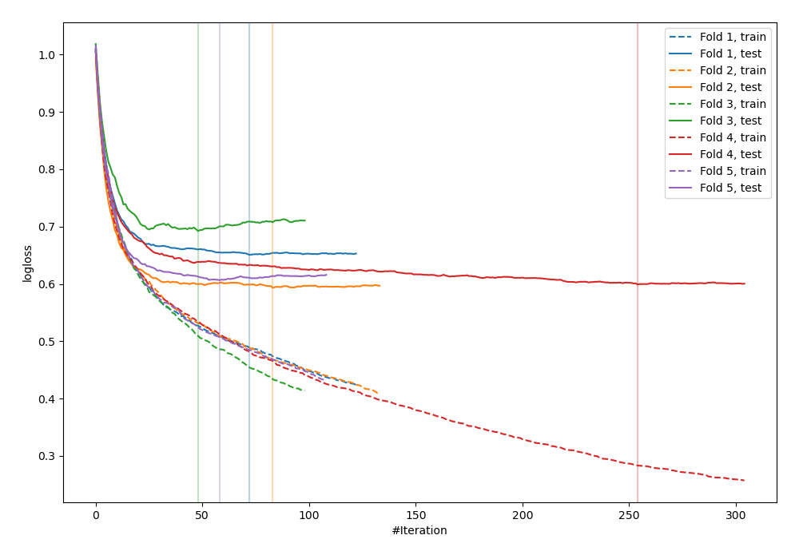
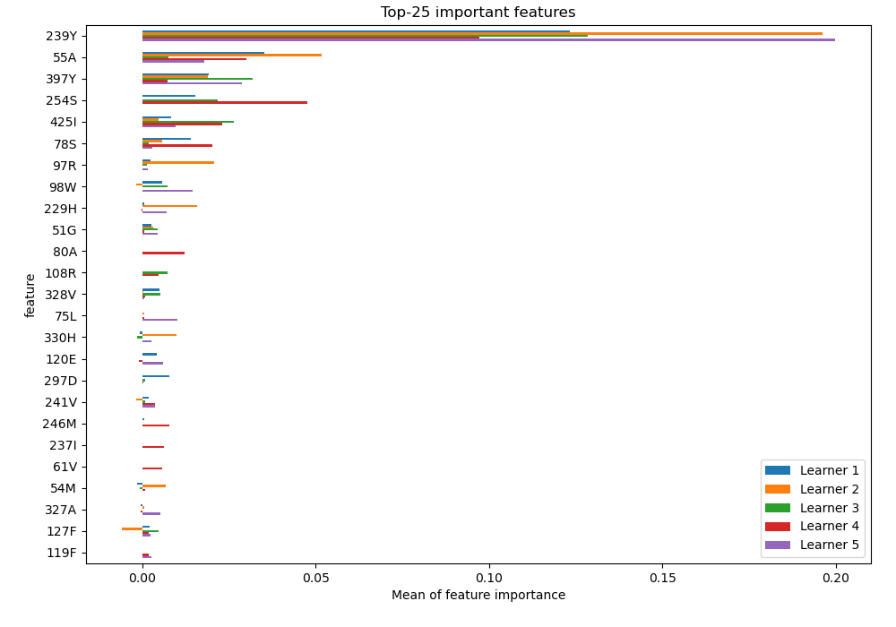
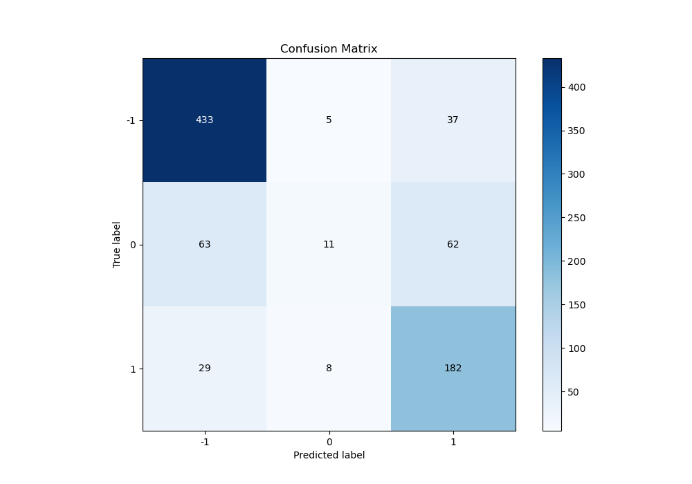
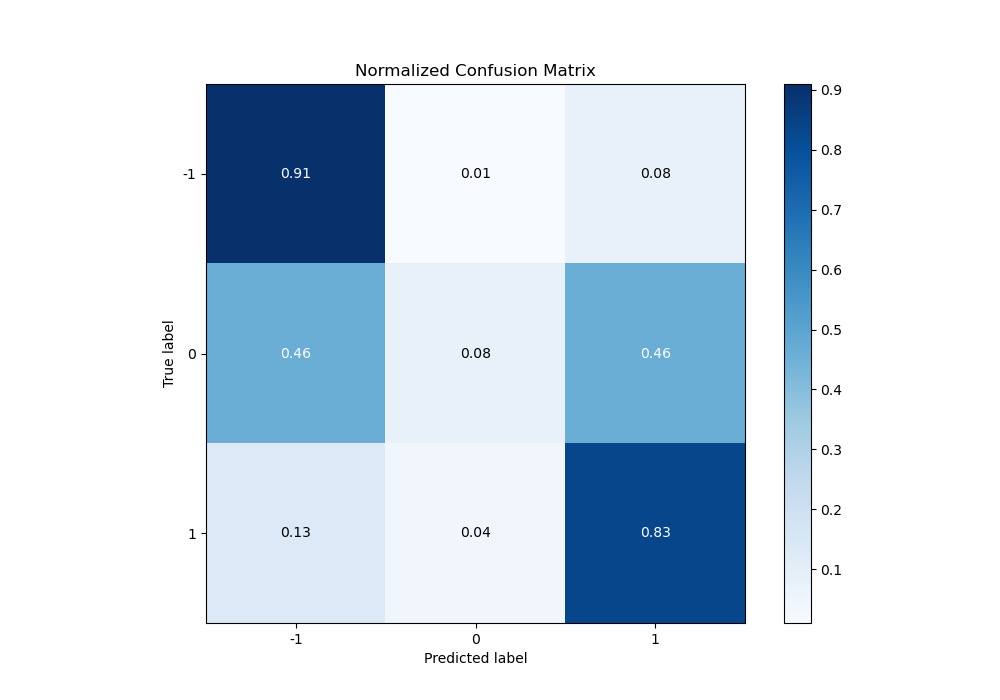
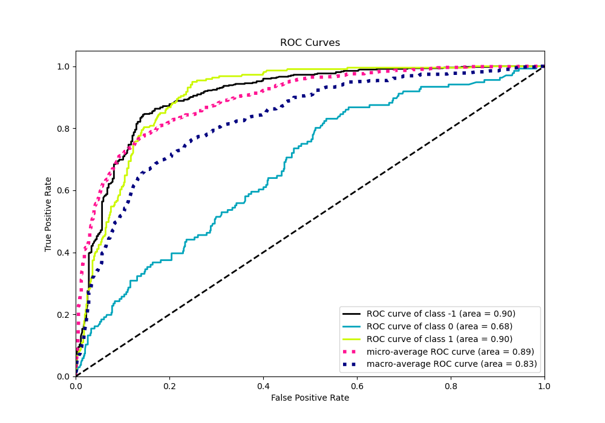
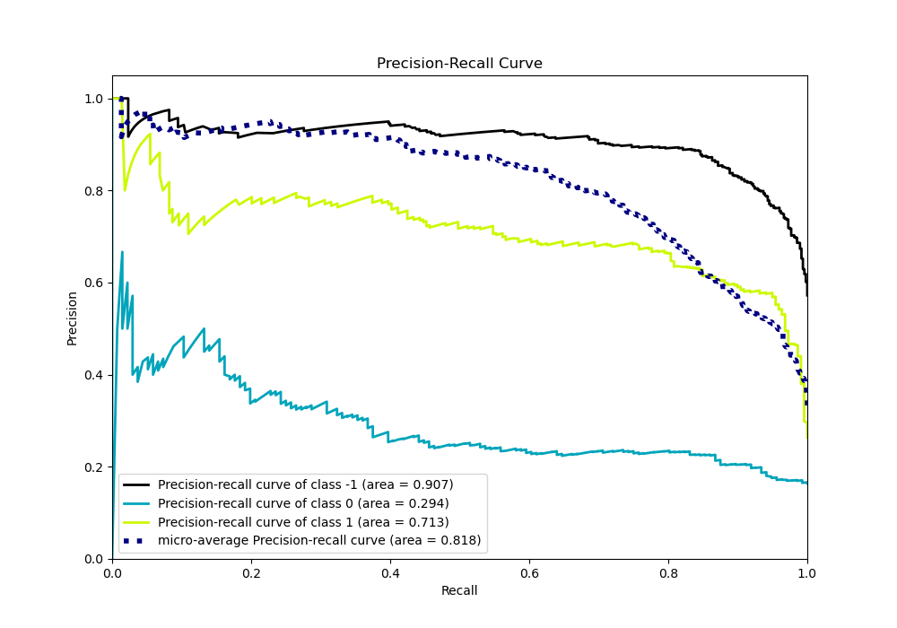

# Summary of 26_CatBoost

[<< Go back](../README.md)

## CatBoost
- **n_jobs**: -1
- **learning_rate**: 0.15
- **depth**: 6
- **rsm**: 0.9
- **loss_function**: MultiClass
- **eval_metric**: MultiClass
- **num_class**: 3
- **explain_level**: 2

## Validation
 - **validation_type**: kfold
 - **k_folds**: 5
 - **shuffle**: True
 - **stratify**: True

## Optimized metric
logloss

## Training time

184.6 seconds

### Metric details
|           |         -1 |           0 |          1 |   accuracy |   macro avg |   weighted avg |   logloss |
|:----------|-----------:|------------:|-----------:|-----------:|------------:|---------------:|----------:|
| precision |   0.824762 |   0.458333  |   0.647687 |   0.754217 |    0.643594 |       0.717998 |  0.628381 |
| recall    |   0.911579 |   0.0808824 |   0.83105  |   0.754217 |    0.607837 |       0.754217 |  0.628381 |
| f1-score  |   0.866    |   0.1375    |   0.728    |   0.754217 |    0.577167 |       0.710219 |  0.628381 |
| support   | 475        | 136         | 219        |   0.754217 |  830        |     830        |  0.628381 |

## Confusion matrix
|               |   Predicted as -1 |   Predicted as 0 |   Predicted as 1 |
|:--------------|------------------:|-----------------:|-----------------:|
| Labeled as -1 |               433 |                5 |               37 |
| Labeled as 0  |                63 |               11 |               62 |
| Labeled as 1  |                29 |                8 |              182 |

## Learning curves

## Permutation-based Importance

## Confusion Matrix

## Normalized Confusion Matrix

## ROC Curve

## Precision Recall Curve

[<< Go back](../README.md)
