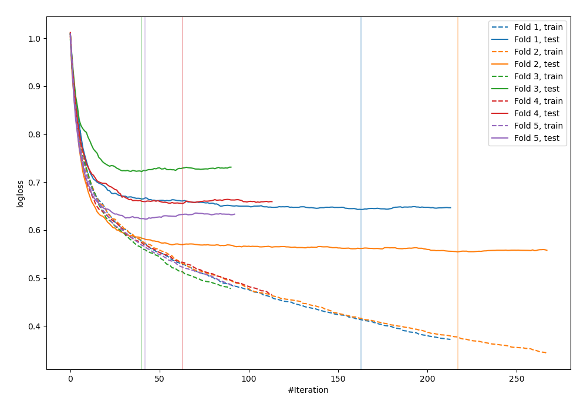
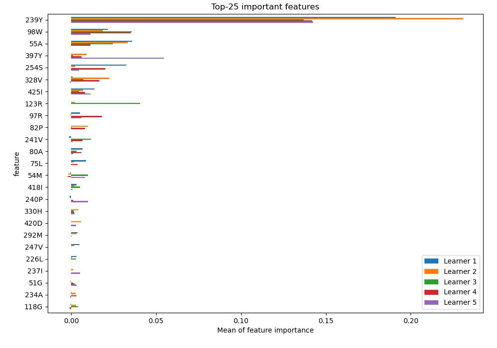
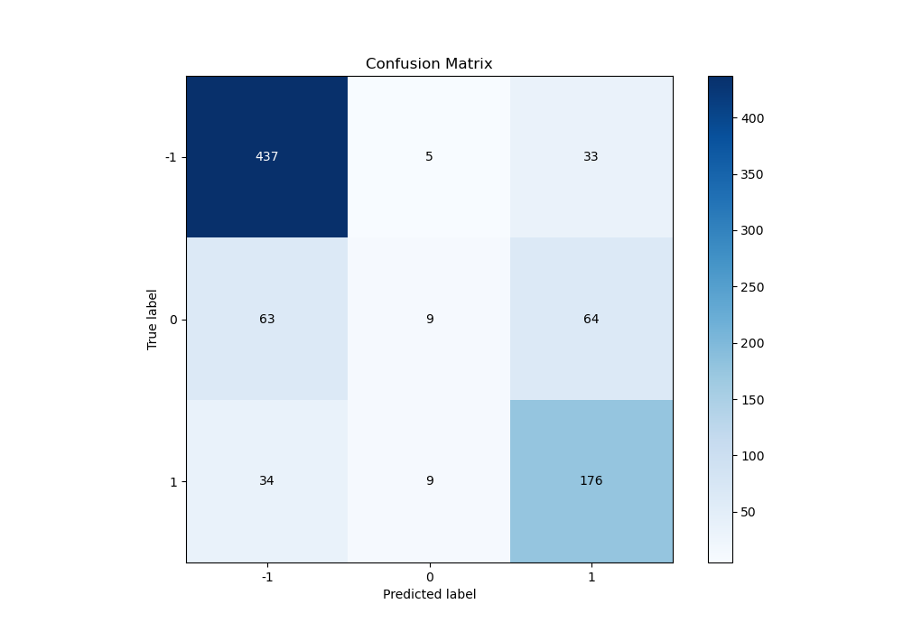
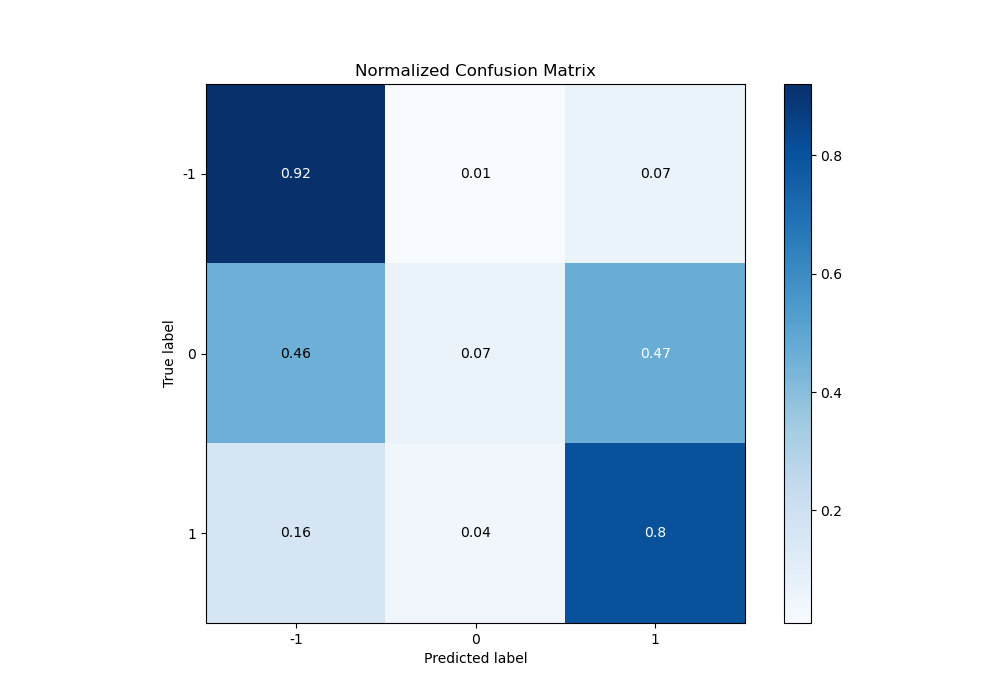
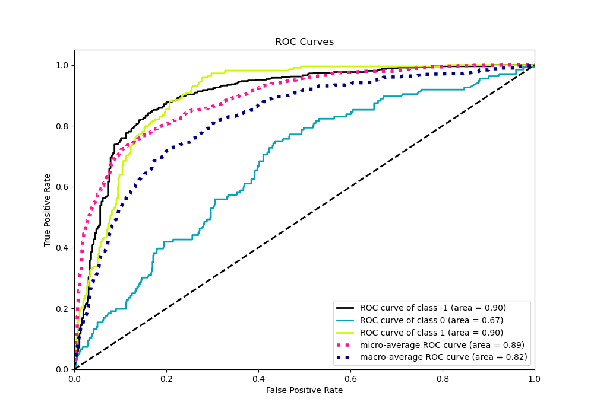
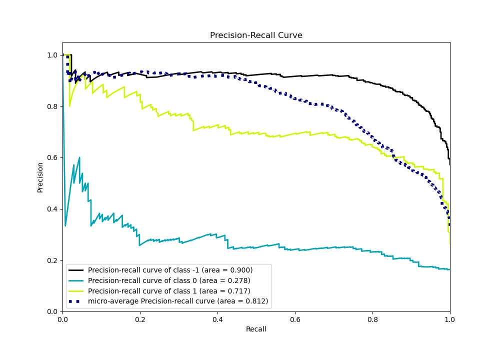

# Summary of 2_Default_CatBoost

[<< Go back](../README.md)

## CatBoost
- **n_jobs**: -1
- **learning_rate**: 0.15
- **depth**: 5
- **rsm**: 1
- **loss_function**: MultiClass
- **eval_metric**: MultiClass
- **num_class**: 3
- **explain_level**: 2

## Validation
 - **validation_type**: kfold
 - **k_folds**: 5
 - **shuffle**: True
 - **stratify**: True

## Optimized metric
logloss

## Training time

173.0 seconds

### Metric details
|           |         -1 |           0 |          1 |   accuracy |   macro avg |   weighted avg |   logloss |
|:----------|-----------:|------------:|-----------:|-----------:|------------:|---------------:|----------:|
| precision |   0.818352 |   0.391304  |   0.644689 |   0.749398 |    0.618115 |       0.702556 |  0.639624 |
| recall    |   0.92     |   0.0661765 |   0.803653 |   0.749398 |    0.59661  |       0.749398 |  0.639624 |
| f1-score  |   0.866204 |   0.113208  |   0.715447 |   0.749398 |    0.564953 |       0.703044 |  0.639624 |
| support   | 475        | 136         | 219        |   0.749398 |  830        |     830        |  0.639624 |

## Confusion matrix
|               |   Predicted as -1 |   Predicted as 0 |   Predicted as 1 |
|:--------------|------------------:|-----------------:|-----------------:|
| Labeled as -1 |               437 |                5 |               33 |
| Labeled as 0  |                63 |                9 |               64 |
| Labeled as 1  |                34 |                9 |              176 |

## Learning curves

## Permutation-based Importance

## Confusion Matrix

## Normalized Confusion Matrix

## ROC Curve

## Precision Recall Curve

[<< Go back](../README.md)
