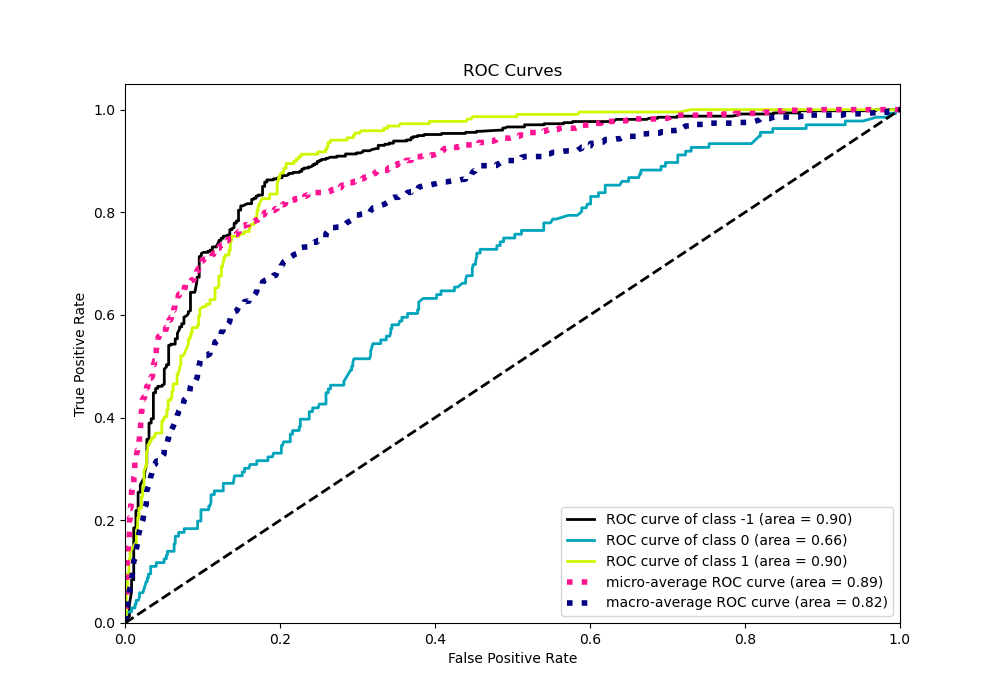

# Summary of 8_CatBoost

[<< Go back](../README.md)

## CatBoost
- **n_jobs**: -1
- **learning_rate**: 0.15
- **depth**: 3
- **rsm**: 0.8
- **loss_function**: MultiClass
- **eval_metric**: MultiClass
- **num_class**: 3
- **explain_level**: 2

## Validation
 - **validation_type**: kfold
 - **k_folds**: 5
 - **shuffle**: True
 - **stratify**: True

## Optimized metric
logloss

## Training time

125.1 seconds

### Metric details
|           |         -1 |           0 |          1 |   accuracy |   macro avg |   weighted avg |   logloss |
|:----------|-----------:|------------:|-----------:|-----------:|------------:|---------------:|----------:|
| precision |   0.816288 |   0.375     |   0.619048 |   0.742169 |    0.603445 |       0.691938 |   0.64949 |
| recall    |   0.907368 |   0.0220588 |   0.83105  |   0.742169 |    0.586826 |       0.742169 |   0.64949 |
| f1-score  |   0.859422 |   0.0416667 |   0.709552 |   0.742169 |    0.53688  |       0.685884 |   0.64949 |
| support   | 475        | 136         | 219        |   0.742169 |  830        |     830        |   0.64949 |

## Confusion matrix
|               |   Predicted as -1 |   Predicted as 0 |   Predicted as 1 |
|:--------------|------------------:|-----------------:|-----------------:|
| Labeled as -1 |               431 |                2 |               42 |
| Labeled as 0  |                63 |                3 |               70 |
| Labeled as 1  |                34 |                3 |              182 |

## Learning curves

## Permutation-based Importance

## Confusion Matrix

## Normalized Confusion Matrix

## ROC Curve

## Precision Recall Curve

[<< Go back](../README.md)
