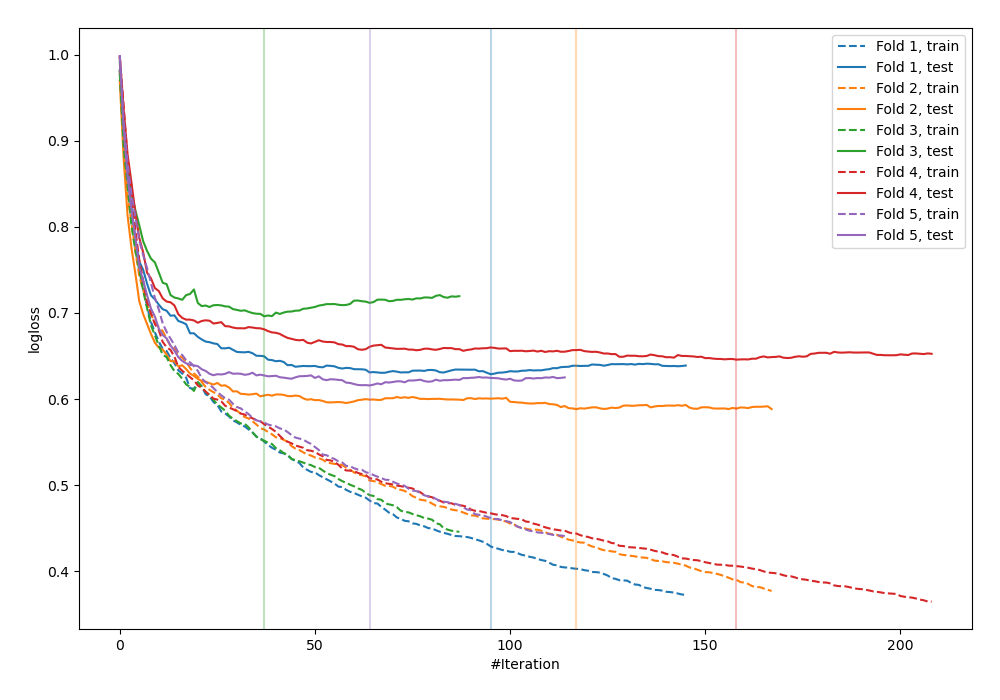
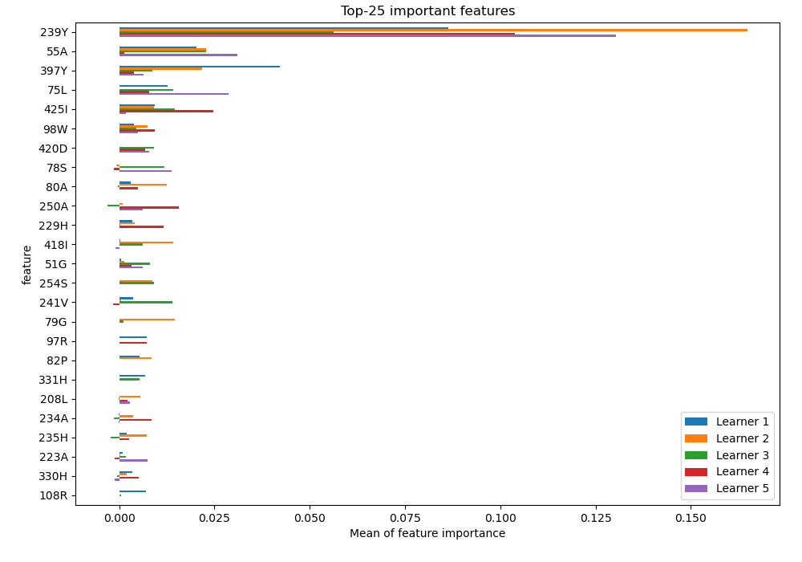
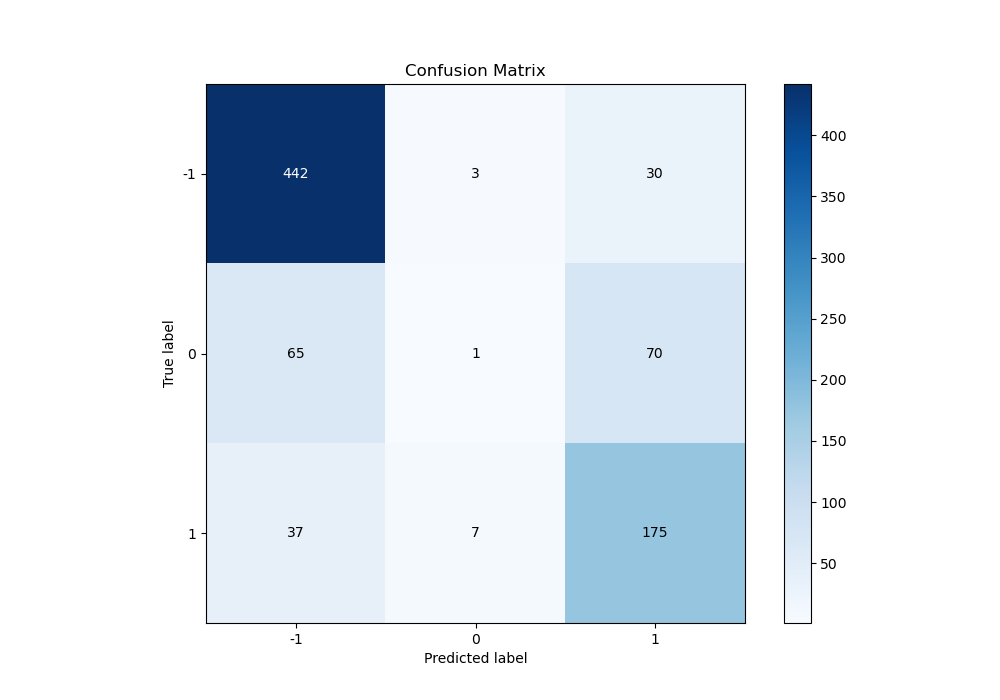
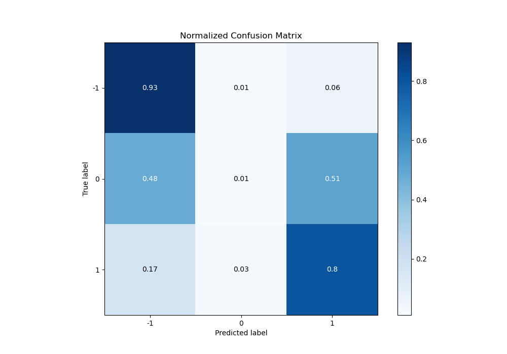
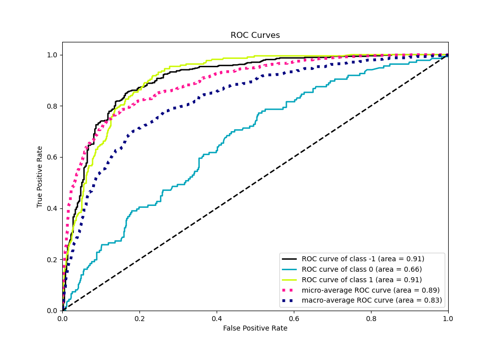
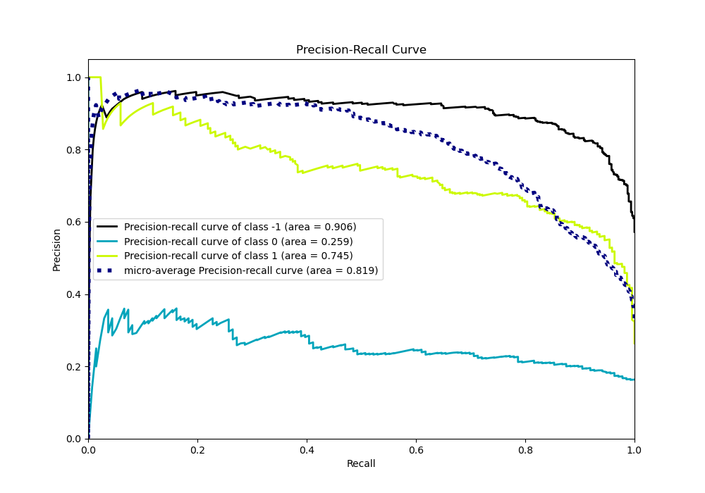

# Summary of 9_CatBoost

[<< Go back](../README.md)

## CatBoost
- **n_jobs**: -1
- **learning_rate**: 0.2
- **depth**: 5
- **rsm**: 0.7
- **loss_function**: MultiClass
- **eval_metric**: MultiClass
- **num_class**: 3
- **explain_level**: 2

## Validation
 - **validation_type**: kfold
 - **k_folds**: 5
 - **shuffle**: True
 - **stratify**: True

## Optimized metric
logloss

## Training time

165.9 seconds

### Metric details
|           |         -1 |            0 |          1 |   accuracy |   macro avg |   weighted avg |   logloss |
|:----------|-----------:|-------------:|-----------:|-----------:|------------:|---------------:|----------:|
| precision |   0.8125   |   0.0909091  |   0.636364 |   0.744578 |    0.513258 |       0.647789 |  0.634913 |
| recall    |   0.930526 |   0.00735294 |   0.799087 |   0.744578 |    0.578989 |       0.744578 |  0.634913 |
| f1-score  |   0.867517 |   0.0136054  |   0.708502 |   0.744578 |    0.529875 |       0.685642 |  0.634913 |
| support   | 475        | 136          | 219        |   0.744578 |  830        |     830        |  0.634913 |

## Confusion matrix
|               |   Predicted as -1 |   Predicted as 0 |   Predicted as 1 |
|:--------------|------------------:|-----------------:|-----------------:|
| Labeled as -1 |               442 |                3 |               30 |
| Labeled as 0  |                65 |                1 |               70 |
| Labeled as 1  |                37 |                7 |              175 |

## Learning curves

## Permutation-based Importance

## Confusion Matrix

## Normalized Confusion Matrix

## ROC Curve

## Precision Recall Curve

[<< Go back](../README.md)
