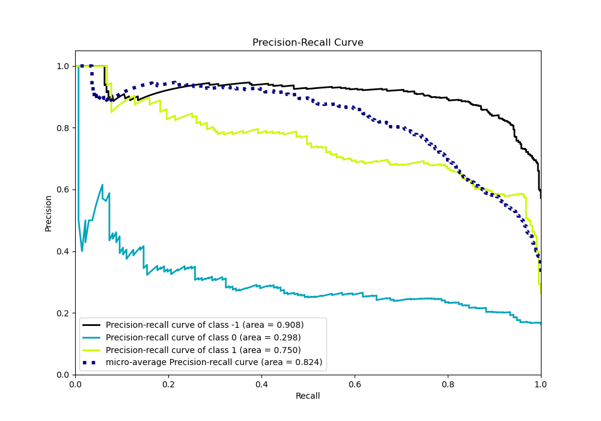

# Summary of Ensemble

[<< Go back](../README.md)

## Ensemble structure
| Model           |   Weight |
|:----------------|---------:|
| 11_CatBoost     |        1 |
| 17_CatBoost     |        1 |
| 26_RandomForest |        1 |
| 9_CatBoost      |        1 |

### Metric details
|           |         -1 |           0 |          1 |   accuracy |   macro avg |   weighted avg |   logloss |
|:----------|-----------:|------------:|-----------:|-----------:|------------:|---------------:|----------:|
| precision |   0.814126 |   0.4       |   0.637631 |   0.750602 |    0.617252 |       0.6997   |  0.621046 |
| recall    |   0.922105 |   0.0147059 |   0.835616 |   0.750602 |    0.590809 |       0.750602 |  0.621046 |
| f1-score  |   0.864758 |   0.0283688 |   0.72332  |   0.750602 |    0.538816 |       0.690392 |  0.621046 |
| support   | 475        | 136         | 219        |   0.750602 |  830        |     830        |  0.621046 |

## Confusion matrix
|               |   Predicted as -1 |   Predicted as 0 |   Predicted as 1 |
|:--------------|------------------:|-----------------:|-----------------:|
| Labeled as -1 |               438 |                2 |               35 |
| Labeled as 0  |                65 |                2 |               69 |
| Labeled as 1  |                35 |                1 |              183 |

## Learning curves

## Confusion Matrix

## Normalized Confusion Matrix

## ROC Curve

## Precision Recall Curve

[<< Go back](../README.md)
