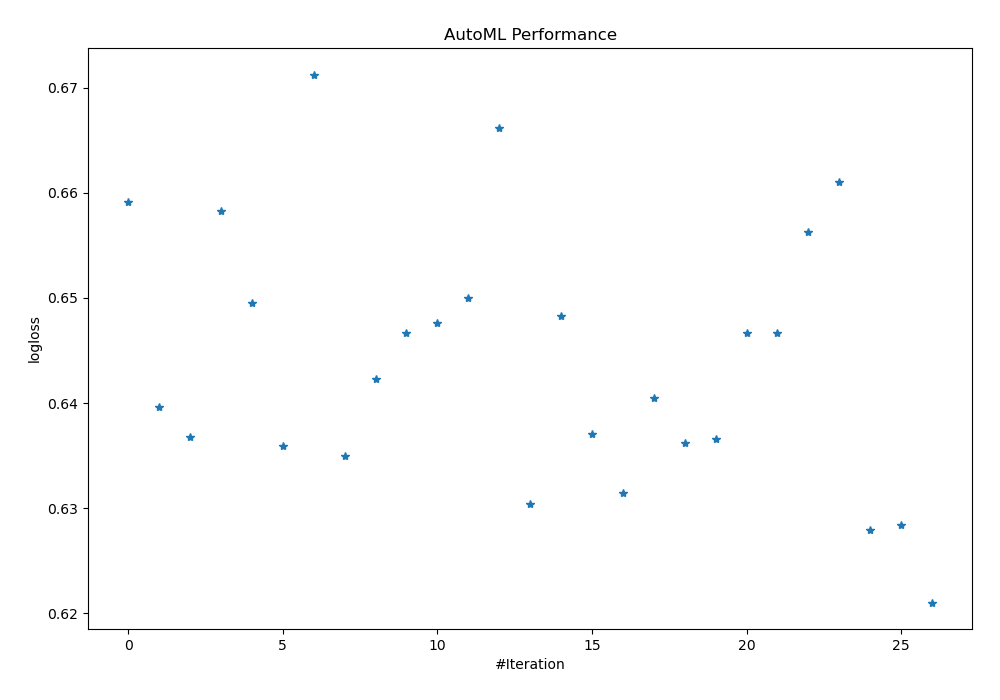
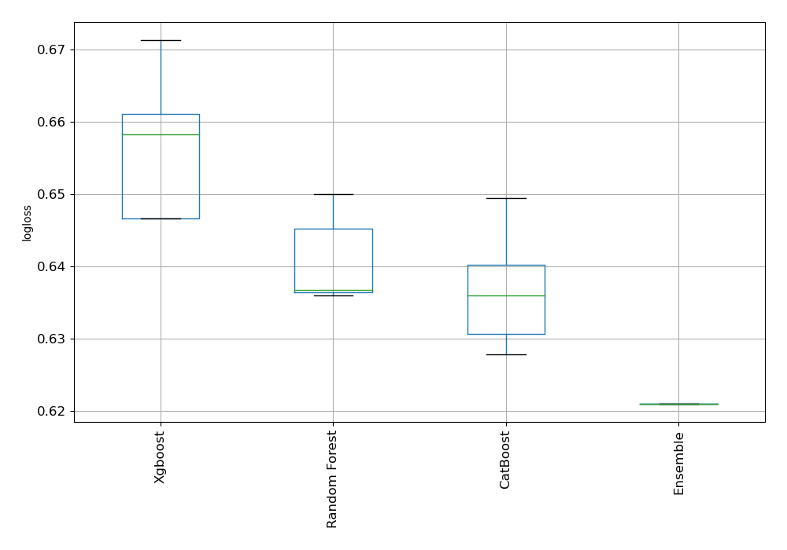
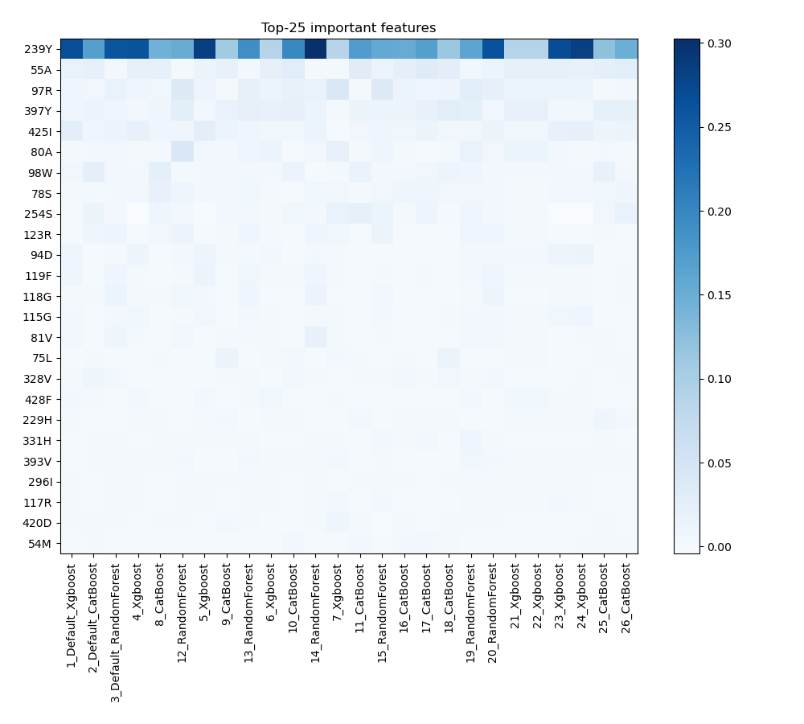
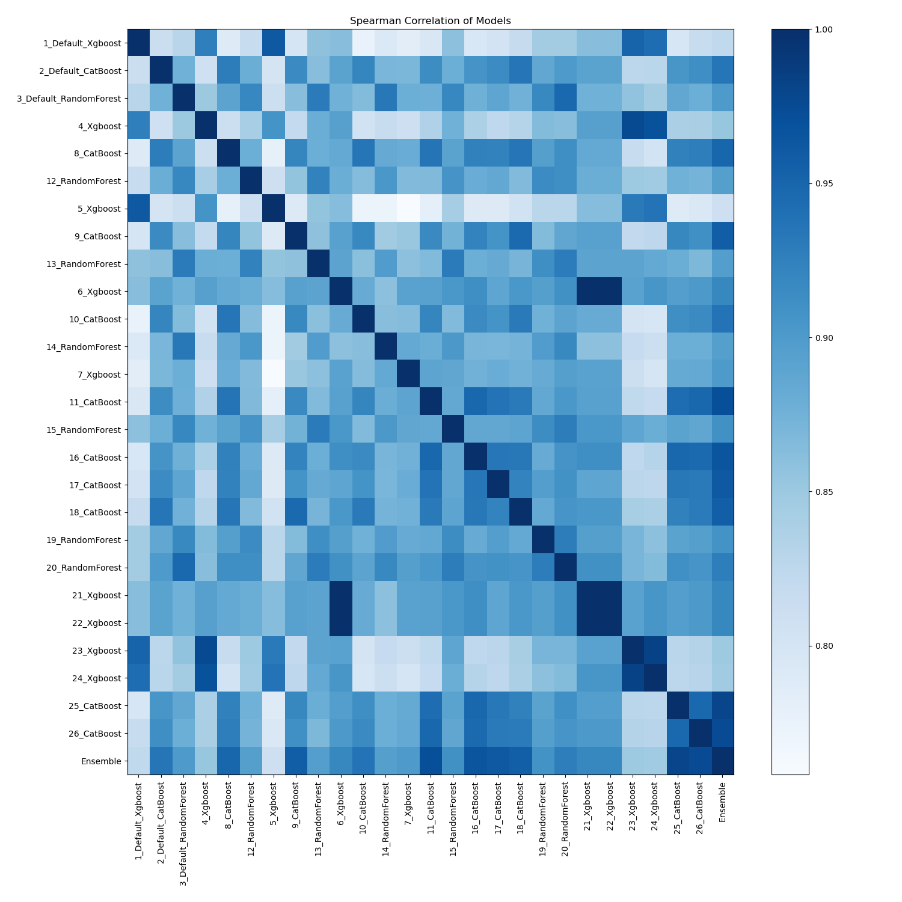

# AutoML Leaderboard

| Best model   | name                                                       | model_type    | metric_type   |   metric_value |   train_time |   single_prediction_time |
|:-------------|:-----------------------------------------------------------|:--------------|:--------------|---------------:|-------------:|-------------------------:|
|              | [1_Default_Xgboost](1_Default_Xgboost/README.md)           | Xgboost       | logloss       |       0.659115 |       165.87 |                   0.25   |
|              | [2_Default_CatBoost](2_Default_CatBoost/README.md)         | CatBoost      | logloss       |       0.639624 |       173.76 |                   0.0271 |
|              | [3_Default_RandomForest](3_Default_RandomForest/README.md) | Random Forest | logloss       |       0.63676  |        52.97 |                   0.3148 |
|              | [4_Xgboost](4_Xgboost/README.md)                           | Xgboost       | logloss       |       0.65824  |       160.72 |                   0.3214 |
|              | [8_CatBoost](8_CatBoost/README.md)                         | CatBoost      | logloss       |       0.64949  |       125.99 |                   0.0276 |
|              | [12_RandomForest](12_RandomForest/README.md)               | Random Forest | logloss       |       0.635951 |        60.25 |                   0.3627 |
|              | [5_Xgboost](5_Xgboost/README.md)                           | Xgboost       | logloss       |       0.671265 |       164.99 |                   0.2525 |
|              | [9_CatBoost](9_CatBoost/README.md)                         | CatBoost      | logloss       |       0.634913 |       166.71 |                   0.0274 |
|              | [13_RandomForest](13_RandomForest/README.md)               | Random Forest | logloss       |       0.642283 |        68.69 |                   0.3536 |
|              | [6_Xgboost](6_Xgboost/README.md)                           | Xgboost       | logloss       |       0.647285 |       166.43 |                   0.2587 |
|              | [10_CatBoost](10_CatBoost/README.md)                       | CatBoost      | logloss       |       0.647652 |       185.62 |                   0.0258 |
|              | [14_RandomForest](14_RandomForest/README.md)               | Random Forest | logloss       |       0.649951 |        66.32 |                   0.3221 |
|              | [7_Xgboost](7_Xgboost/README.md)                           | Xgboost       | logloss       |       0.666494 |       166.28 |                   0.25   |
|              | [11_CatBoost](11_CatBoost/README.md)                       | CatBoost      | logloss       |       0.630375 |       203.69 |                   0.0444 |
|              | [15_RandomForest](15_RandomForest/README.md)               | Random Forest | logloss       |       0.648259 |        77.21 |                   0.5241 |
|              | [16_CatBoost](16_CatBoost/README.md)                       | CatBoost      | logloss       |       0.637018 |       282.3  |                   0.0269 |
|              | [17_CatBoost](17_CatBoost/README.md)                       | CatBoost      | logloss       |       0.631446 |       191.32 |                   0.0262 |
|              | [18_CatBoost](18_CatBoost/README.md)                       | CatBoost      | logloss       |       0.640457 |       177.53 |                   0.0283 |
|              | [19_RandomForest](19_RandomForest/README.md)               | Random Forest | logloss       |       0.636181 |        76.72 |                   0.4499 |
|              | [20_RandomForest](20_RandomForest/README.md)               | Random Forest | logloss       |       0.636615 |        73.73 |                   0.324  |
|              | [21_Xgboost](21_Xgboost/README.md)                         | Xgboost       | logloss       |       0.647285 |       177.93 |                   0.2558 |
|              | [22_Xgboost](22_Xgboost/README.md)                         | Xgboost       | logloss       |       0.647285 |       179.73 |                   0.3441 |
|              | [23_Xgboost](23_Xgboost/README.md)                         | Xgboost       | logloss       |       0.656264 |       181.71 |                   0.2473 |
|              | [24_CatBoost](24_CatBoost/README.md)                       | CatBoost      | logloss       |       0.636132 |       208.37 |                   0.0293 |
|              | [26_RandomForest](26_RandomForest/README.md)               | Random Forest | logloss       |       0.634493 |        76.58 |                   0.3688 |
| **the best** | [Ensemble](Ensemble/README.md)                             | Ensemble      | logloss       |       0.621046 |         0.35 |                   0.4107 |

### AutoML Performance

### AutoML Performance Boxplot

### Features Importance

### Spearman Correlation of Models

